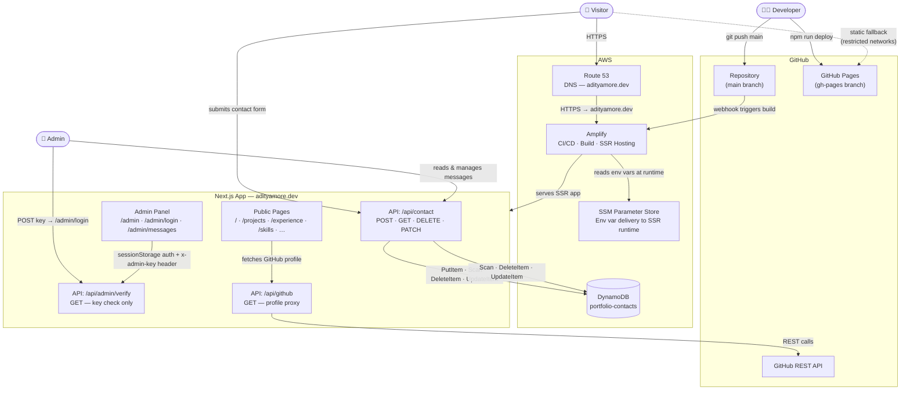

# Tech Portfolio — Aditya More

A personal portfolio web application built to go beyond the limitations of a one-page resume. This project serves as a living showcase of my skills, projects, and professional journey, presented through an interactive and polished interface.

Live (primary): [adityamore.dev](https://adityamore.dev)
Live (GitHub Pages mirror): [skywalker1910.github.io/Tech-Portfolio](https://skywalker1910.github.io/Tech-Portfolio)

---

## About This Project

The core idea behind this web application is to create a single, centralized source that accurately represents who I am as a software and AI/ML engineer. A traditional resume is constrained to one page and cannot adequately capture the depth of projects, research, and skills that define a modern engineering career. This portfolio is the answer to that problem.

The goals of this project are:

- **Showcase work in depth** — Projects, research, and experience presented with full context, not just a bullet point.
- **Provide an interactive experience** — Visitors can explore skills, timelines, and projects in an engaging interface rather than reading a static document.
- **Consolidate everything in one place** — Work history, education, projects, skills, and contact information all accessible under one roof.
- **Stand out in a competitive job market** — Demonstrate not just what I have built, but how I think about building software.
- **Practice industry-grade software development** — This project is developed following standard SDLC practices: version control, branching, issue tracking, code review discipline, CI/CD pipelines, and production-grade deployment.

---

## Features

### Interactive Interface
- Animated particle field background with real-time mouse interaction (GPU-optimized canvas rendering)
- Interstellar background mode as an alternate visual theme
- BB-8 inspired AI assistant droid — an animated, stateful floating button that opens an AI-powered chat interface
- Custom cursor with interactive states
- Dark and light theme toggle with persistent user preference

### Content Sections
- Home — Introduction with animated sentence flip, scroll-driven animations, and a summary of skills and highlights
- Projects — Full project gallery with tag-based filtering and categorization
- Experience — Professional timeline with detailed role descriptions
- Education — Academic background and certifications
- Skills — Categorized technical skill set
- Socials — Links and contact channels
- Contact — Contact form backed by AWS DynamoDB

### Technical Highlights
- Server-side API routes for the contact form and GitHub data fetching
- Interactive 3D globe visualization using the `cobe` library
- GitHub profile integration via a live API proxy
- Responsive, mobile-first layout
- Accessibility considerations including skip-to-content links and reduced-motion support
- SEO-ready with Open Graph metadata and a generated sitemap

### Admin Control Panel (`/admin`)
- Password-protected control panel accessible only to the site owner
- Tile-based landing page (Command Center) with time-aware greeting and per-section navigation
- Messages Monitor — view, search, sort, and filter all contact form submissions with live stat cards
- Per-message controls: mark read/unread, tag sender type (Recruiter / Visitor / Friend / Test), delete with 2-click confirmation
- Lightweight key-based authentication: `ADMIN_KEY` env var validated server-side; key stored in `sessionStorage` client-side
- Admin routes are fully excluded from public navigation, sitemaps, and search engine indexing
- Extensible architecture — Projects, Experience, Timeline, and Skills panels planned

---

## Tech Stack

| Layer | Technology |
|---|---|
| Layer | Technology |
|---|---|
| Framework | Next.js 16 (App Router) |
| Language | TypeScript |
| Styling | Tailwind CSS v4 |
| Animation | Framer Motion |
| UI Icons | Lucide React, React Icons |
| Globe | Cobe |
| Database | AWS DynamoDB (via AWS SDK v3 `@aws-sdk/lib-dynamodb`) |
| Hosting & CI/CD | AWS Amplify |
| DNS | AWS Route 53 |
| Static Mirror | GitHub Pages |
| Env Delivery (SSR) | AWS SSM Parameter Store |
| Fonts | Inter, Space Grotesk (Google Fonts) |
| Build Tool | Turbopack |

---

## Deployment Architecture

This project is deployed across two environments to maximize availability.

### Primary — AWS (adityamore.dev)
- **AWS Amplify** handles CI/CD, build, and hosting. Every push to the `main` branch triggers an automatic production deployment.
- **AWS Route 53** manages the DNS for the custom `adityamore.dev` domain.
- The application runs as a full Next.js server with API routes, image optimization, and server-side rendering enabled.

### Mirror — GitHub Pages (skywalker1910.github.io/Tech-Portfolio)
- A fully static export of the application is deployed to GitHub Pages via the `gh-pages` branch.
- This mirror exists specifically for users on restricted networks — such as university campuses — where `.dev` TLD domains may be blocked at the DNS level.
- The static build is produced with `npm run build:ghpages` which sets `NEXT_PUBLIC_GITHUB_PAGES=true`, enabling the static export configuration in `next.config.ts` (base path, asset prefix, static image handling).
- Deployment to GitHub Pages is done via `npm run deploy` using the `gh-pages` package.

---

## System Architecture

The diagram below shows how all services and components interact with each other in production.



### Service Responsibilities

| Service | Role |
|---|---|
| **AWS Amplify** | CI/CD pipeline triggered on every `main` push; builds and hosts the Next.js SSR application; manages TLS certificates |
| **AWS Route 53** | DNS hosting for `adityamore.dev`; routes traffic to the Amplify CloudFront distribution |
| **AWS DynamoDB** | Stores all contact form submissions; table name configured via `DYNAMODB_CONTACTS_TABLE` |
| **AWS SSM Parameter Store** | Delivers environment variables (DynamoDB credentials, `ADMIN_KEY`) to the Amplify SSR runtime at request time |
| **Next.js API Routes** | `/api/contact` — full CRUD for contact messages; `/api/admin/verify` — stateless admin key validation; `/api/github` — GitHub profile proxy to avoid CORS and rate limits |
| **Admin Control Panel** | Private `/admin/*` routes for managing contact messages; auth via `ADMIN_KEY` env var checked on every protected API call |
| **GitHub Pages** | Static export mirror at `skywalker1910.github.io/Tech-Portfolio`; deployed manually via `npm run deploy` using the `gh-pages` package |
| **GitHub API** | Public REST API proxied through `/api/github` to serve live repository and profile data on the portfolio |

### Authentication Flow

The admin panel uses a simple shared-secret pattern appropriate for a single-owner tool:

1. Admin navigates to `/admin/login` and enters the secret key.
2. The login page calls `GET /api/admin/verify` with the key in the `x-admin-key` request header.
3. The server compares it against `process.env.ADMIN_KEY` — no database involved in this check.
4. On success, the key is stored in `sessionStorage` under `dashboard-admin-key`.
5. All subsequent admin API calls attach the key as the `x-admin-key` header. The server re-validates it on every request.
6. Sign-out clears `sessionStorage` and redirects to `/admin/login`.

### Data Model — Contact Message

Each contact form submission is stored as a DynamoDB item with the following shape:

```json
{
  "id": "uuid-v4",
  "name": "string",
  "email": "string",
  "message": "string",
  "timestamp": "ISO-8601 string",
  "read": false,
  "senderType": "recruiter | visitor | friend | test | null"
}
```

---

## Using This as a Template

This repository is open source under the MIT License. If you would like to use it as the foundation for your own portfolio, you are welcome to do so.

### Steps to get started

1. **Fork or clone** this repository.

2. **Update personal data** — Replace all personal content with your own:
   - `app/layout.tsx` — Update the `metadata` object (title, description, Open Graph fields).
   - `data/contacts.json` — Update contact links and social handles.
   - `app/page.tsx` — Update the home page content, timeline data, and skill tags.
   - `app/projects/page.tsx` — Replace with your own project entries.
   - `app/experience/page.tsx` and `app/education/page.tsx` — Add your own work and academic history.

3. **Replace assets** — Swap out any images or public assets in the `public/` directory with your own.

4. **Configure deployment**:
   - For AWS Amplify: connect the repository in the Amplify console and set your environment variables there.
   - For GitHub Pages: update the `homepage` field in `package.json` and the `basePath`/`assetPrefix` values in `next.config.ts` to match your GitHub username and repository name.

5. **Set up environment variables** — Create a `.env.local` file at the root (never commit it). Required variables:

   | Variable | Purpose |
   |---|---|
   | `APP_AWS_ACCESS_KEY_ID` | AWS IAM access key (note: Amplify reserves the `AWS_` prefix, so use `APP_AWS_*` locally and in Amplify) |
   | `APP_AWS_SECRET_ACCESS_KEY` | AWS IAM secret key |
   | `APP_AWS_REGION` | AWS region for DynamoDB (e.g. `us-east-1`) |
   | `DYNAMODB_CONTACTS_TABLE` | DynamoDB table name (defaults to `portfolio-contacts`) |
   | `ADMIN_KEY` | Secret key for the admin control panel |

   If you do not need the contact form or admin panel, remove `/api/contact`, `/api/admin`, and the corresponding UI components.

6. **Remove or update the license attribution** — You may keep or modify the `LICENSE` file. Attribution is appreciated but not required.

---

## License

This project is licensed under the MIT License. See the [LICENSE](LICENSE) file for details.

---

## Documentation

Developer notes, known issues, and planned features are tracked in [docs/DEVELOPMENT.md](docs/DEVELOPMENT.md).
