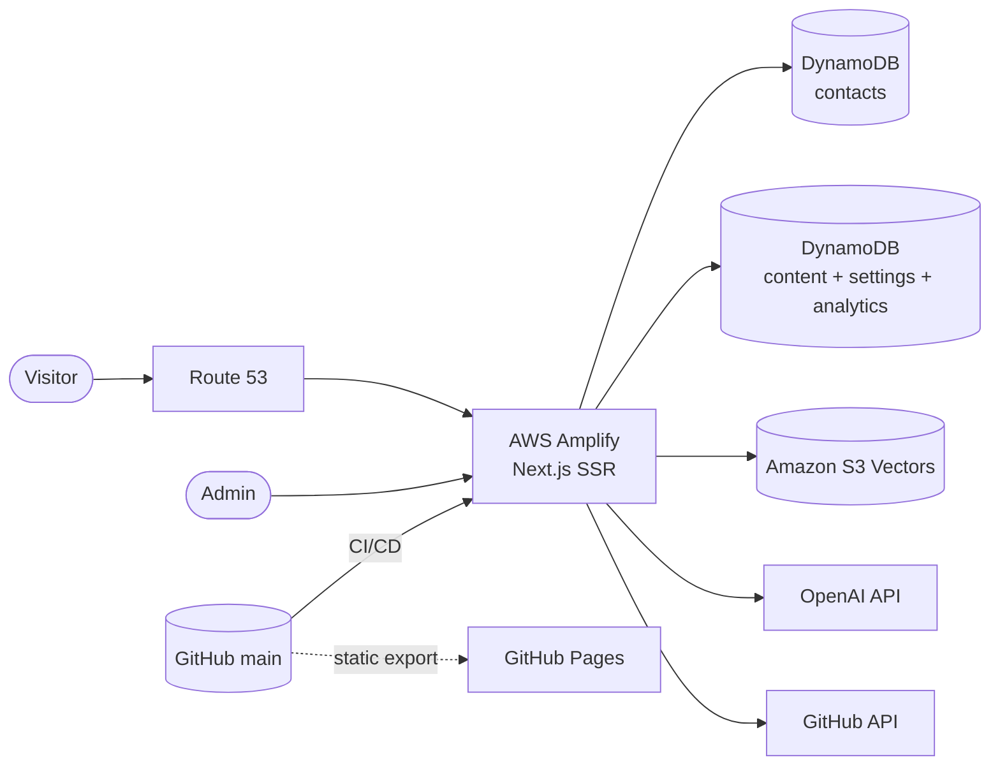

# Tech Portfolio — Aditya More

An interactive Next.js portfolio for presenting Aditya More’s AI/ML engineering work, research, experience, and technical skills. The application includes BB-8, a retrieval-augmented portfolio co-pilot; live owner-managed content; a private operations dashboard; and privacy-conscious first-party analytics.

- Primary site: [adityamore.dev](https://adityamore.dev)
- Static mirror: [skywalker1910.github.io/Tech-Portfolio](https://skywalker1910.github.io/Tech-Portfolio)

## Highlights

- Polished responsive interface with light-first theming, dark mode, animated navigation previews, project filtering, career timelines, GitHub integration, and accessible interaction states.
- BB-8 overlay and full-page chat powered by the OpenAI Responses API, verified portfolio knowledge, OpenAI embeddings, and Amazon S3 Vectors.
- Hybrid retrieval with deterministic local fallback, source-page links, a short context window, and a 27-question evaluation suite.
- Validated agent actions for in-app navigation, resume download, and reviewable contact-form drafts.
- Private Admin Command Center for project and experience CRUD, contact-message management, RAG configuration/status, vector reindexing, and traffic monitoring.
- Tiered first-party analytics: opt-out cookieless UX measurement plus optional pseudonymous return-visit journeys, with no raw-IP storage or third-party analytics SDK.
- AWS Amplify SSR production deployment plus an optional GitHub Pages static mirror.

See [Implemented Features](docs/FEATURES.md) for the full shipped-feature inventory.

## Architecture


```mermaid
flowchart LR
    Visitor([Visitor]) --> DNS[Route 53]
    DNS --> App[AWS Amplify\nNext.js SSR]
    Admin([Admin]) --> App

    App --> Contacts[(DynamoDB\ncontacts)]
    App --> Content[(DynamoDB\ncontent + settings + analytics)]
    App --> Vectors[(Amazon S3 Vectors)]
    App --> OpenAI[OpenAI API]
    App --> GitHub[GitHub API]

    Repo[(GitHub main)] -->|CI/CD| App
    Repo -. static export .-> Mirror[GitHub Pages]
```

The application keeps browser interactions, server-side trust boundaries, public data, operational data, and third-party AI calls separate. The complete diagrams, request flows, failure behavior, and DynamoDB key design are documented in [System Architecture](docs/ARCHITECTURE.md).

## Technology stack

| Layer | Technology |
|---|---|
| Application | Next.js 16 App Router, React 19, TypeScript |
| Styling | Tailwind CSS v4, CSS Modules |
| Animation | Framer Motion |
| Visualizations | Cobe, Canvas, custom CSS 3D transforms |
| AI | OpenAI Responses API and Embeddings API |
| Retrieval | Amazon S3 Vectors plus local keyword fallback |
| Data | AWS DynamoDB via AWS SDK v3 |
| Hosting | AWS Amplify SSR and Route 53 |
| Static mirror | GitHub Pages |
| Build | Turbopack |

## Project structure

```text
app/
  admin/                 Private Command Center pages
  api/                   Public and protected route handlers
  chat/                  Full-page BB-8 experience
  projects/              Filterable project gallery
  experience/            Detailed professional experience
  notice/ privacy/       Product status and data disclosures
components/
  admin/                 Shared administration components
  BB8ChatDroid.tsx       Interactive BB-8 visual
  ChatWidget.tsx         Persistent chat and agent-action UI
  TrafficTracker.tsx     Tiered measurement, engagement, and journeys
data/                    Verified static knowledge and contact links
lib/
  content/               Content models, validation, defaults, repository
  rag/                   Chunking, indexing, retrieval, and types
scripts/                 AWS setup, content seed, indexing, evaluation
docs/                    Architecture and operating documentation
evals/                   RAG evaluation cases
```

## Local development

Requirements: Node.js 20 or newer, npm, and optional AWS/OpenAI credentials for server-backed features.

```powershell
npm install
Copy-Item .env.example .env.local
npm run dev
```

Open `http://localhost:3000`. Without AWS or OpenAI configuration, public pages still render from bundled content. Contact submission, semantic retrieval, admin writes, and analytics require their corresponding services.

### Environment variables

| Variable | Required for | Notes |
|---|---|---|
| `OPENAI_API_KEY` | BB-8 and indexing | Server-only secret |
| `OPENAI_CHAT_MODEL` | BB-8 | Configurable generation model |
| `OPENAI_EMBEDDING_MODEL` | RAG indexing/query | Defaults to `text-embedding-3-small` |
| `OPENAI_EMBEDDING_DIMENSIONS` | RAG | Must match the vector index |
| `RAG_ENABLED` | Semantic retrieval | Local fallback remains available |
| `RAG_VECTOR_BUCKET` | S3 Vectors | Globally unique bucket name |
| `RAG_VECTOR_INDEX` | S3 Vectors | Defaults to `portfolio-knowledge` |
| `RAG_TOP_K` | Retrieval | Safe runtime override is available in Admin |
| `RAG_MAX_DISTANCE` | Retrieval | Safe runtime override is available in Admin |
| `APP_AWS_REGION` | AWS clients | Defaults to `us-east-1` |
| `APP_AWS_ACCESS_KEY_ID` | Local AWS access | Prefer an Amplify compute role in production |
| `APP_AWS_SECRET_ACCESS_KEY` | Local AWS access | Never expose to the browser |
| `DYNAMODB_CONTACTS_TABLE` | Contact form | Defaults to `portfolio-contacts` |
| `DYNAMODB_PORTFOLIO_TABLE` | Content/operations | Defaults to `portfolio-content` |
| `ADMIN_KEY` | Admin login | Single-owner shared secret |
| `ADMIN_SESSION_SECRET` | Admin session signing | Falls back to `ADMIN_KEY` if omitted |
| `GITHUB_TOKEN` | GitHub API | Recommended in production; increases API allowance and reduces anonymous rate-limit failures |
| `NEXT_PUBLIC_FULL_CHAT_URL` | Chat links | Defaults to `/chat` |

Use `.env.example` as the canonical variable template. Do not commit `.env.local`.

## AWS resource setup

### Content and operations table

```powershell
npm run content:setup
npm run content:seed
```

This creates the on-demand `portfolio-content` table, enables TTL, and seeds the initial project and experience records. See [Command Center](docs/COMMAND_CENTER.md) for IAM permissions and publishing behavior.

### RAG vector resources

```powershell
npm run rag:setup
npm run rag:index
npm run rag:evaluate:s3
```

Set `RAG_ENABLED=true` after the index is ready. See [BB-8 Portfolio RAG](docs/RAG.md) for the retrieval architecture, IAM policies, tuning, and evaluation workflow.

The contacts table is intentionally separate because contact submissions have a different key shape and privacy lifecycle from public portfolio content.

## Useful commands

| Command | Purpose |
|---|---|
| `npm run dev` | Start local development |
| `npm run build` | Build the Amplify/SSR application |
| `npm run lint` | Run ESLint |
| `npm run typecheck` | Check TypeScript without emitting files |
| `npm run check` | Run the complete local pull-request quality gate |
| `npm run content:setup` | Create the portfolio operations table |
| `npm run content:seed` | Seed projects and experience |
| `npm run rag:setup` | Create/validate S3 Vector resources |
| `npm run rag:index` | Rebuild the current published corpus |
| `npm run rag:evaluate` | Evaluate local retrieval |
| `npm run rag:evaluate:s3` | Evaluate semantic retrieval |
| `npm run build:ghpages` | Produce the static mirror |
| `npm run deploy` | Publish the static mirror |

## Deployment

Pushes to `main` trigger the AWS Amplify build. `amplify.yml` writes an allow-listed set of server variables into `.env.production` for the Next.js SSR runtime. Route 53 provides the custom domain.

Pull requests targeting `main` run the GitHub Actions `Quality gate`: lint, TypeScript, local RAG evaluation, and a production build. See [Pull Requests and Release Checks](docs/PULL_REQUESTS.md) for the review checklist and recommended `main` branch protection.

The GitHub Pages mirror is a static export. API-backed functionality—including BB-8 responses, live admin content, analytics, and contact submission—is unavailable or reduced on that mirror by design.

## Security and privacy

- Secrets remain server-side.
- Admin access uses a signed `HttpOnly`, `SameSite=Strict` cookie.
- APIs validate lengths, enums, paths, and URLs.
- BB-8 cannot send a contact message for a visitor.
- Basic first-party UX measurement is cookieless and opt-out; persistent journey analytics requires opt-in. Both honor Do Not Track and Global Privacy Control.
- Analytics stores a one-way pseudonymous visitor key rather than the browser UUID or raw IP address.
- Chat requests set `store: false`; the app does not persist chat transcripts server-side.
- Analytics stores page/engagement aggregates and coarse UX context; enhanced mode adds hashed visitor/visit identifiers and journeys. Raw IP addresses are never persisted.
- Contact submissions are visible only through protected admin APIs.

Read the public [Privacy Policy](https://adityamore.dev/privacy) and the implementation details in [System Architecture](docs/ARCHITECTURE.md).

## Documentation

| Document | Contents |
|---|---|
| [Implemented Features](docs/FEATURES.md) | Shipped functionality and explicit non-features |
| [System Architecture](docs/ARCHITECTURE.md) | Diagrams, flows, data model, trust boundaries, failures |
| [API Reference](docs/API.md) | Public and protected endpoint contracts |
| [Command Center](docs/COMMAND_CENTER.md) | DynamoDB setup, IAM, publishing, auth, analytics |
| [BB-8 Portfolio RAG](docs/RAG.md) | Indexing, retrieval, evaluation, permissions, tuning |
| [Developer Notes](docs/DEVELOPMENT.md) | Development workflow, fallbacks, deployment caveats |
| [Pull Requests and Release Checks](docs/PULL_REQUESTS.md) | CI, review checklist, branch protection, and release verification |
| [Issue & Fix Changelog](docs/CHANGELOG.md) | Historical production incidents and fixes |
| [Code Citations](docs/%23%20Code%20Citations.md) | Third-party code and license attributions |

## License

Licensed under the [MIT License](LICENSE).
