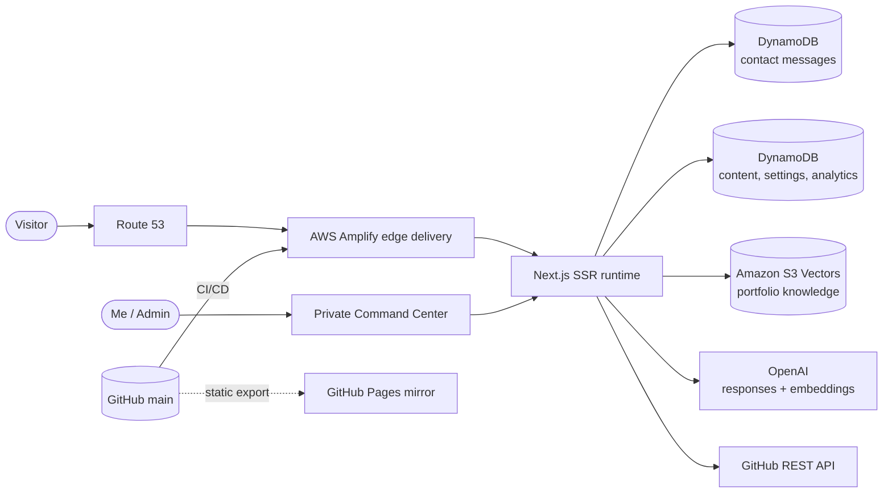
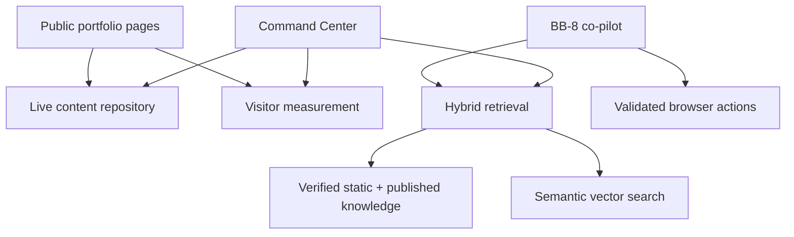

# My Tech Portfolio

An interactive, production-hosted portfolio for presenting my AI/ML engineering work, research, experience, and technical capabilities. The application combines a responsive public experience, BB-8 as my RAG-powered portfolio co-pilot, live content I manage, a private operations dashboard, and privacy-conscious first-party analytics.

- Primary application: [adityamore.dev](https://adityamore.dev)
- Static continuity mirror: [skywalker1910.github.io/Tech-Portfolio](https://skywalker1910.github.io/Tech-Portfolio)

## Product capabilities

- Responsive light-first interface with dark mode, animated navigation previews, filterable project content, career timelines, GitHub statistics, and accessible interaction states.
- BB-8 overlay and full-page chat grounded in verified portfolio knowledge through OpenAI embeddings, Amazon S3 Vectors, and deterministic keyword retrieval.
- Validated co-pilot actions for contextual page navigation, resume delivery, and reviewable contact-form drafts.
- Live project and experience publishing backed by DynamoDB, with bundled content as a resilience fallback.
- Private Command Center for content operations, contact messages, RAG configuration and indexing, and visitor-experience analytics.
- Tiered first-party analytics with cookieless aggregate measurement, optional pseudonymous journeys, manual audience classification, and no stored raw IP address.
- AWS Amplify SSR production hosting with Route 53, IAM compute-role access, DynamoDB, S3 Vectors, and an optional GitHub Pages static mirror.

The full shipped-feature inventory is maintained in [Implemented Features](docs/FEATURES.md).

## High-level architecture

```mermaid
flowchart LR
    Visitor([Visitor]) --> DNS[Route 53]
    DNS --> Edge[AWS Amplify edge delivery]
    Edge --> App[Next.js SSR runtime]
    Me([Me / Admin]) --> Admin[Private Command Center]
    Admin --> App

    App --> Contacts[(DynamoDB\ncontact messages)]
    App --> Operations[(DynamoDB\ncontent, settings, analytics)]
    App --> Vectors[(Amazon S3 Vectors\nportfolio knowledge)]
    App --> OpenAI[OpenAI\nresponses + embeddings]
    App --> GitHub[GitHub REST API]

    Repo[(GitHub main)] -->|CI/CD| Edge
    Repo -. static export .-> Mirror[GitHub Pages mirror]
```

The browser owns presentation, animations, session-scoped chat state, privacy preferences, and approved co-pilot actions. Next.js route handlers form the server trust boundary: they validate requests, enforce admin authorization, access AWS through the Amplify compute role, and call external services without exposing credentials.

## Core runtime flows

```mermaid
flowchart TB
    Public[Public portfolio pages]
    Chat[BB-8 co-pilot]
    Content[Live content repository]
    Analytics[Visitor measurement]
    Admin[Command Center]

    Public --> Content
    Public --> Analytics
    Chat --> Retrieval[Hybrid retrieval]
    Retrieval --> Knowledge[Verified static + published knowledge]
    Retrieval --> Vectors[Semantic vector search]
    Chat --> Actions[Validated browser actions]
    Admin --> Content
    Admin --> Retrieval
    Admin --> Analytics
```

- Public content reads DynamoDB first and automatically falls back to bundled records when the operations table is unavailable.
- BB-8 retrieves a small set of verified chunks, sends only a short conversation window to OpenAI, and returns source routes and optional validated actions.
- Basic analytics records aggregate UX signals without a persistent identity; enhanced analytics adds opt-in visit continuity and page journeys.
- Content publication and RAG indexing are deliberately separate so multiple edits can be indexed in one controlled operation.

Detailed system, sequence, trust-boundary, and data-model diagrams are available in [System Architecture](docs/ARCHITECTURE.md).

## Technology stack

| Layer | Technology |
|---|---|
| Web application | Next.js 16 App Router, React 19, TypeScript |
| Styling and interaction | Tailwind CSS v4, CSS Modules, Framer Motion |
| Specialized visuals | Cobe, Canvas, CSS 3D transforms |
| AI generation | OpenAI Responses API |
| Retrieval | OpenAI Embeddings API, Amazon S3 Vectors, local keyword fallback |
| Operational data | Amazon DynamoDB through AWS SDK v3 |
| Hosting and delivery | AWS Amplify SSR, CloudFront-managed delivery, Route 53 |
| Source and quality gate | GitHub, GitHub Actions, Turbopack |
| Continuity surface | GitHub Pages static export |

## Reliability and privacy posture

- Server-only credentials remain outside browser bundles and production AWS access uses temporary compute-role credentials.
- Admin sessions are signed, eight-hour, `HttpOnly`, `SameSite=Strict` cookies.
- OpenAI chat requests set `store: false`; the application does not persist BB-8 transcripts server-side.
- RAG falls back to deterministic local retrieval when semantic retrieval is disabled or unavailable.
- Live content falls back to source-controlled defaults when DynamoDB cannot be read.
- Analytics excludes raw IP storage, exact location, fingerprints, advertising identifiers, form values, and chat text.
- The GitHub proxy is cached and fails independently from the rest of the public experience.
- Production changes pass linting, TypeScript checks, RAG evaluation, and a Next.js production build before merge.

## Documentation index

| Document | Technical scope |
|---|---|
| [System Architecture](docs/ARCHITECTURE.md) | End-to-end topology, runtime boundaries, integrated flows, data ownership, and failure behavior |
| [AWS Infrastructure](docs/AWS_INFRASTRUCTURE.md) | Amplify, Route 53, compute role, DynamoDB, S3 Vectors, environment delivery, IAM, and resource lifecycle |
| [BB-8 RAG System](docs/RAG.md) | Corpus assembly, chunking, embeddings, indexing, hybrid retrieval, generation, tools, tuning, and evaluation |
| [Visitor Analytics](docs/ANALYTICS.md) | Measurement tiers, attributes, traffic sources, engagement, storage model, privacy controls, and dashboard semantics |
| [Live Content System](docs/CONTENT_SYSTEM.md) | Project and experience models, publishing, validation, fallback behavior, DynamoDB layout, and RAG synchronization |
| [Security Model](docs/SECURITY.md) | Trust boundaries, admin authentication, secret handling, validation, privacy controls, and known limitations |
| [API Reference](docs/API.md) | Public and protected route contracts, limits, responses, and side effects |
| [Command Center](docs/COMMAND_CENTER.md) | My operational surfaces for content, messages, RAG, and analytics |
| [Implemented Features](docs/FEATURES.md) | Current application capabilities and explicit non-features |
| [Engineering and Runtime Notes](docs/DEVELOPMENT.md) | Source-of-truth boundaries, resilience rules, deployment-time configuration, and documentation ownership |
| [Pull Requests and Release Checks](docs/PULL_REQUESTS.md) | CI quality gate, review expectations, branch protection, release verification, and rollback |
| [Operational Incident Log](docs/CHANGELOG.md) | Historical production issues, root causes, fixes, and verification evidence |
| [Code Citations](docs/CODE_CITATIONS.md) | Retained third-party code-attribution record |
