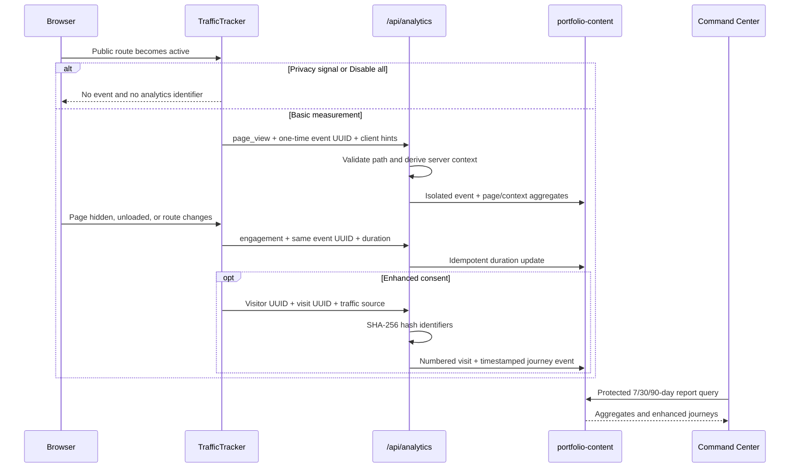

# Visitor Analytics

## Purpose and boundaries

The portfolio uses a first-party analytics subsystem to answer product and UX questions: which pages are useful, how engagement differs by layout and device category, which broad locations and sources bring traffic, and whether enhanced-consent visitors return.

The system is not an advertising or identity-resolution platform. It does not persist raw IP addresses, exact location, fingerprints, advertising identifiers, form values, keystrokes, or BB-8 messages. I assign audience labels such as recruiter manually; the application never infers them from geography or behavior.

## Measurement tiers

| Behavior | Basic measurement | Enhanced journeys |
|---|---|---|
| Activation | Enabled by default, with opt-out | Affirmative opt-in |
| Cookie use | None | None |
| Persistent browser ID | No | Random UUID in `localStorage` |
| Visit ID | No | Random UUID in `sessionStorage` |
| Page and engagement aggregates | Yes | Yes |
| Device, OS, browser, viewport | Broad categories | Broad categories |
| Country and optional region | Yes | Yes |
| Traffic source | No | Broad category and hostname |
| Page journey | No | Timestamped route sequence |
| Returning visit number | No | Yes |
| Manual audience label | No profile exists | Optional annotation by me |

Do Not Track and Global Privacy Control disable both tiers. The footer’s **Analytics choices** control lets a visitor select enhanced analytics, retain basic measurement only, or disable all analytics.

## Event flow

Page engagement is reported after at least one second and capped at two hours. `sendBeacon` is preferred during page exit so the event can finish without delaying navigation. The operational event record makes engagement idempotent: the same event UUID cannot add its duration twice.

## Captured attributes

| Attribute | Derivation | Precision and use |
|---|---|---|
| Path | Next.js pathname | Public route only; query strings are removed |
| Timestamp | Server clock | ISO timestamp and UTC calendar day |
| Engagement duration | Browser elapsed time | 1 second to 2 hours |
| Country | Amplify/CloudFront viewer header | Two-letter country code |
| Region | Compatible edge header, when present | Broad state/region name or code |
| Device category | User agent plus touch hints | Mobile, Tablet, Desktop, Unknown |
| Operating system | User agent/platform | Android, iOS/iPadOS, Windows, macOS, Chrome OS, Linux, Unknown |
| Browser | User agent | Chrome, Safari, Edge, Firefox, Opera, Other |
| Viewport bucket | Browser width | Compact, Mobile, Tablet, Laptop, Desktop |
| Traffic source | `document.referrer` | Enhanced only; category plus hostname |
| Visit continuity | Random browser and visit UUIDs | Enhanced only; hashed before storage |

The device category describes the browser-reported client class. Browsers cannot reliably distinguish a physical laptop from a desktop computer, so viewport buckets provide the layout-oriented signal used for UI decisions.

## Traffic-source classification

Traffic source is evaluated from `document.referrer` only for enhanced journeys.

| Condition | Category |
|---|---|
| No referrer | Direct |
| Portfolio hostname | Internal |
| Google, Bing, Yahoo, DuckDuckGo | Search |
| LinkedIn, GitHub, Facebook, Instagram, X/Twitter, Reddit | Social |
| Any other validated hostname | Referral |

Only the lowercase hostname is retained, with a 120-character limit and a conservative character allow list. The full referring URL, route, query parameters, search terms, and fragments are discarded. The first source is retained on the enhanced visit summary, while aggregate source metrics count measured page views and engagement by category.

Referrer suppression by browsers, mobile apps, email clients, or privacy tools can cause an external visit to appear as Direct. UTM parameters are not currently processed. Unknown platforms are classified as Referral.

## Identity and visit semantics

Enhanced analytics creates a random visitor UUID in browser storage and a random visit UUID for the active tab session. A visit rolls over after 30 minutes of inactivity. The API accepts these identifiers only as valid UUIDs and stores SHA-256 hashes rather than the original values.

The visitor profile tracks first seen, last seen, visit count, coarse latest context, and an optional manual audience segment. Each new visit increments the counter, which produces Visit #1, Visit #2, and subsequent labels. Page events are stored below the hashed visitor/visit key.

These identifiers are pseudonymous rather than anonymous: they support continuity within one browser profile but do not reveal a person’s real identity. Clearing browser storage creates a new identifier.

## DynamoDB model

All analytics records use the `portfolio-content` table.

| Partition key | Sort key | Record |
|---|---|---|
| `OP_EVENT#<eventHash>` | `SUMMARY` | One basic page event, context key, and optional duration |
| `ANALYTICS#<day>` | `PAGE#<path>` | Views, enhanced sessions, engagement totals |
| `ANALYTICS#<day>` | `CONTEXT#<hash>` | Coarse context/source aggregate |
| `ANALYTICS_SESSION#<day>` | `<path>#<hash>` | Enhanced daily path-session deduplication |
| `ANALYTICS_VISITS#<day>` | `<startedAt>#<visitHash>` | Recent enhanced-visit index |
| `VISITOR#<visitorHash>` | `PROFILE` | Visit count and manual audience segment |
| `VISITOR#<visitorHash>` | `VISIT#<visitHash>` | Visit summary and first acquisition source |
| `VISITOR#<visitorHash>` | `VISIT#<visitHash>#EVENT#...` | Timestamped route activity |

Every analytics record receives `expiresAt` with a target retention of approximately 365 days. DynamoDB TTL removes eligible records asynchronously.

## API validation and abuse controls

`POST /api/analytics` accepts `page_view` and `engagement` events. It:

- Rejects admin/API paths and removes query strings.
- Validates event, visitor, and visit UUID formats.
- Requires visitor and visit identifiers together.
- Accepts traffic source only with enhanced identifiers.
- Caps request bodies at 4 KiB.
- Applies a 120-request, one-minute, per-IP in-memory limit.
- Uses the request IP only for volatile rate limiting and never persists it.
- Returns `Cache-Control: no-store`.

Analytics failures are intentionally non-blocking. A DynamoDB failure returns an accepted/no-op response so measurement cannot degrade page navigation.

## Dashboard semantics

The private Traffic dashboard provides 7-, 30-, and 90-day views of:

- Total page views and average measured engagement.
- Enhanced visits, returning visits, and journey coverage.
- Daily activity.
- Device, viewport, country, region, OS, browser, and source breakdowns.
- Page views, enhanced sessions, and average engagement by route.
- Up to 100 recent enhanced visits with timestamps and page sequences.
- Manual audience classification: unclassified, recruiter, hiring manager, technical peer, student, or general visitor.

Journey coverage is the percentage of all measured page views that also belong to enhanced sessions. It helps distinguish aggregate measurement from the smaller consented journey sample.

Dashboard insights are directional. Low traffic, missing referrers, shared devices, browser storage resets, and absent region headers can affect interpretation.

## Configuration and dependencies

The subsystem uses the existing portfolio DynamoDB table and compute-role permissions: `BatchGetItem`, `GetItem`, `PutItem`, `UpdateItem`, and `Query`. No third-party analytics SDK, additional table, or persistent client cookie is required.

Coarse location depends on the headers delivered to the SSR route. When the edge does not provide location headers, the record uses an unavailable/unknown value rather than deriving location through another service.

Privacy-facing behavior must remain synchronized across:

- `components/TrafficTracker.tsx`
- `app/api/analytics/route.ts`
- `lib/analytics.ts`
- `app/admin/traffic/page.tsx`
- `app/privacy/page.tsx`
- `app/notice/page.tsx`
