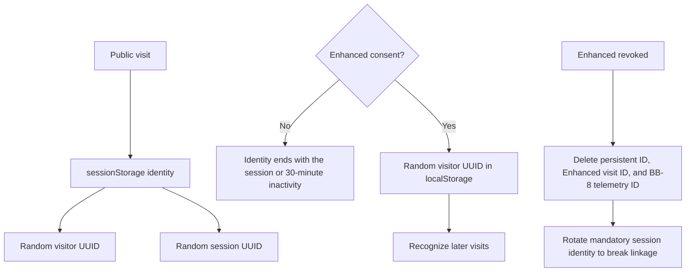
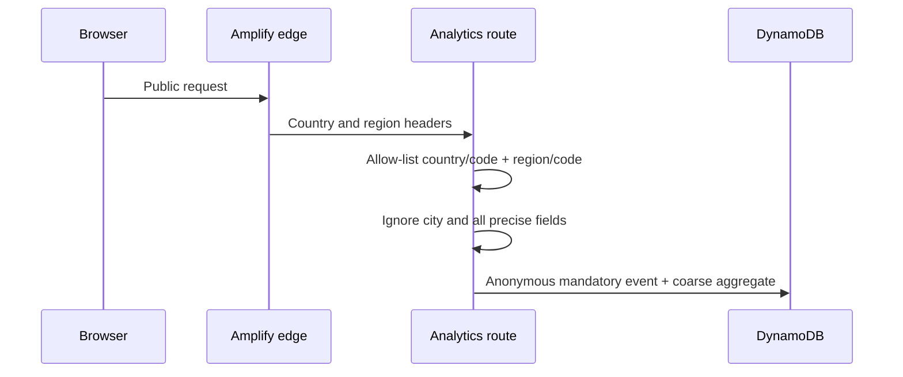

# Visitor Analytics

## Purpose and boundaries

I use a first-party, purpose-limited analytics system to understand portfolio reach, geographic distribution, returning visits, content engagement, traffic sources, and BB-8 reliability. It is not an advertising, cross-site tracking, fingerprinting, or identity-resolution system.

I never persist raw IP addresses, city, county, postal/ZIP code, coordinates, GPS data, browser fingerprints, advertising identifiers, form contents, keystrokes, mouse movement, clipboard contents, or BB-8 prompt/response text as analytics. Audience labels are assigned manually; geography and behavior never classify a visitor automatically.

## Data purposes and consent

| Purpose | Activation | Data |
|---|---|---|
| Mandatory telemetry | Every public visit | Random visitor ID, random session ID, server timestamp, country, country code, region/state, region code |
| Basic Analytics | Explicit Basic or Enhanced choice | Page views, engagement duration, coarse device/OS/browser/viewport, controlled feature events, BB-8 adoption/performance |
| Enhanced Analytics | Explicit Enhanced choice | Persistent random visitor recognition, visit number, first/last seen, journey, traffic-source category, sanitized referring hostname, detailed BB-8 agent action |
| Contact processing | Visitor submits the form | Name, email, message, submission timestamp; optional one-way analytics link only under Enhanced |

Mandatory telemetry is deliberately small. It is never used to justify page, device, source, journey, or feature collection before consent. Do Not Track and Global Privacy Control disable both optional tiers.

## Identity lifecycle



- UUIDs are cryptographically random, opaque, non-semantic, and unrelated to IP, email, name, user agent, or geography.
- Without Enhanced consent, the visitor ID exists only in `sessionStorage`; it does not create a cross-session profile.
- Enhanced consent stores one random visitor UUID in `localStorage` and one random visit ID in `sessionStorage`.
- Revocation stops future optional collection and removes optional persistent identifiers. No fingerprint or hidden replacement identifier is created.
- The server hashes identifiers with SHA-256 before persistence. Browser UUIDs are not written directly to DynamoDB.

## Geographic flow



The runtime reads only:

- `CloudFront-Viewer-Country`
- `CloudFront-Viewer-Country-Name`
- `CloudFront-Viewer-Country-Region-Name`
- `CloudFront-Viewer-Country-Region`
- compatible Vercel country/region fallbacks outside AWS

If a provider supplies city, county, postal code, latitude, longitude, or other precise fields, the application does not read or persist them. The raw IP may be temporarily available to infrastructure. Request handlers convert it to a short-lived one-way process-local rate-limit key that is never persisted or used as visitor identity.

## Controlled event model

Events use an allow-listed envelope rather than arbitrary analytics payloads:

```text
event_id
visitor_id
session_id
event_name
timestamp
page
feature
metadata
```

The server validates UUIDs, strips query strings from pages, constrains feature names, and reconstructs metadata from an allow-list. Event metadata cannot accept form contents, prompts, email addresses, arbitrary URLs, or arbitrary query parameters.

Supported Basic feature events are:

- `project_opened`
- `demo_started`
- `demo_completed`
- `external_link_clicked`
- `contact_form_started`
- `contact_form_submitted`

The system does not track every click, cursor position, scroll position, or keystroke.

## Traffic attribution

Attribution is Enhanced-only. The client converts a referrer to a controlled category and sanitized hostname. It never stores the full referrer URL or query string.

Supported categories are `direct`, `internal`, `search`, `social`, `professional_network`, `github`, `referral`, and `other`.

## BB-8 telemetry

BB-8 remains fully usable without optional analytics. With Basic or Enhanced consent, telemetry may record:

- `copilot_opened`, request success/failure, latency, model, and token totals;
- random visitor, session, and BB-8 chat-session references, hashed before storage;
- RAG usage/fallback and broad country/region/device context;
- detailed agent-action type only under Enhanced consent.

The chat route sends a short conversation window to OpenAI for the requested response with `store: false`. Neither the analytics event writer nor the telemetry builder accepts full prompt or response fields. The visible transcript stays in same-tab `sessionStorage`.

## Contact separation

Contact submissions live in the separate contacts table. A contact record is not automatically treated as analytics. When Enhanced consent is active at submission time, the server may store a one-way hashed analytics reference with the message. Without Enhanced consent, no linkage is created.

## Browser storage

| Store | Key purpose |
|---|---|
| `localStorage` | Consent preference/version; Enhanced-only persistent random visitor ID |
| `sessionStorage` | Current anonymous visitor/session ID, Enhanced visit ID, BB-8 session/transcript, temporary contact draft |
| Cookie | No public analytics cookie; one signed `HttpOnly`, `SameSite=Strict` cookie for my private admin session |

The server is the authoritative analytics store. Full histories are never placed in browser storage.

## DynamoDB record families

| Key family | Purpose |
|---|---|
| `MANDATORY_EVENT#...` | Idempotent mandatory visitor/session event |
| `MANDATORY_VISITORS#<day>` | Daily unique-visitor deduplication by coarse location |
| `ANALYTICS#<day> / GEO#...` | Mandatory country/region visit and visitor aggregates |
| `OP_EVENT#...` | Basic page or controlled feature event |
| `ANALYTICS#<day> / PAGE#...` | Basic page aggregates |
| `ANALYTICS#<day> / CONTEXT#...` | Basic coarse device/location aggregates |
| `VISITOR#...` and `ANALYTICS_VISITS#...` | Enhanced profiles, visits, and journeys |
| `ANALYTICS_CHAT_EVENT#...` | Purpose-limited BB-8 event records |
| `ANALYTICS#<day> / CHAT...` | BB-8 aggregate metrics |

## Retention

All periods are centralized in `lib/analytics-policy.ts` and configurable through environment variables.

| Category | Default | Environment variable |
|---|---:|---|
| Mandatory telemetry | 90 days | `ANALYTICS_MANDATORY_RETENTION_DAYS` |
| Basic Analytics | 180 days | `ANALYTICS_BASIC_RETENTION_DAYS` |
| Enhanced Analytics | 180 days | `ANALYTICS_ENHANCED_RETENTION_DAYS` |
| BB-8 telemetry | 90 days | `ANALYTICS_BB8_RETENTION_DAYS` |
| Contact submissions | 365 days | `CONTACT_RETENTION_DAYS` |

DynamoDB TTL is asynchronous: `expiresAt` marks deletion eligibility, not an exact deletion time. Aggregates currently follow their category’s retention window; detailed records are not retained indefinitely.

## Command Center reporting

The Traffic dashboard separates mandatory reach from consented behavior:

- mandatory visitors, visits, countries, and regions;
- Basic page, engagement, feature, device, OS, browser, and viewport metrics;
- Enhanced sources, return visits, timestamped journeys, and manual audience labels;
- BB-8 opens, sessions, outcomes, latency, token totals, retrieval behavior, and region/device summaries.

The OpenAI usage page is a separate provider dashboard based on OpenAI organization/project usage APIs. It is not derived from stored chat content.

The reporting layer remains backward compatible with Enhanced visitor indexes created before mandatory reach telemetry was introduced. For each day, it selects the broader of the mandatory reach aggregate and the retained Enhanced visit index. Geography follows the same per-day source selection. This makes retained historical visitors visible without copying records or double-counting visitors represented in both record families.

## Operations and migration

After deploying this model, I run `npm run analytics:purge-city` once with the intended AWS credentials to remove historical city attributes from existing analytics records. The script logs only item counts. It does not print record content.

I can run `npm run analytics:audit` as a read-only inventory check. It reports record-family counts, active/expired counts, date coverage, and attribute coverage without printing visitor identifiers or attribute values.

I verify the policy with `npm run analytics:test` and the complete repository gate with `npm run check`.
