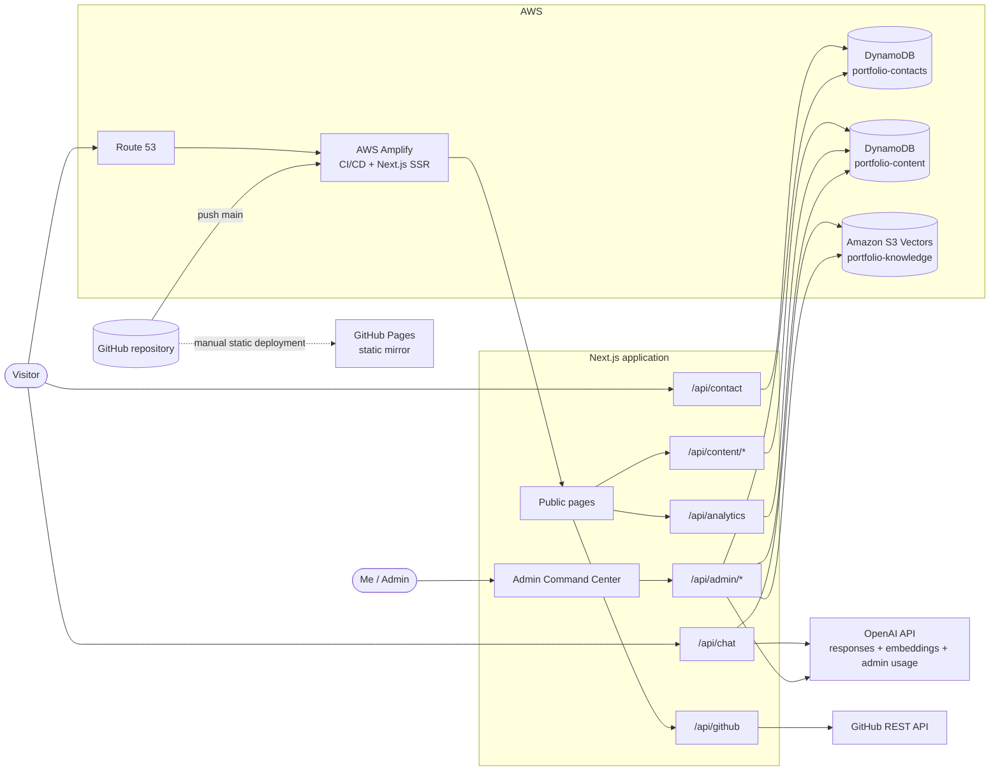
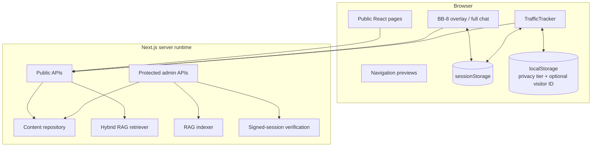
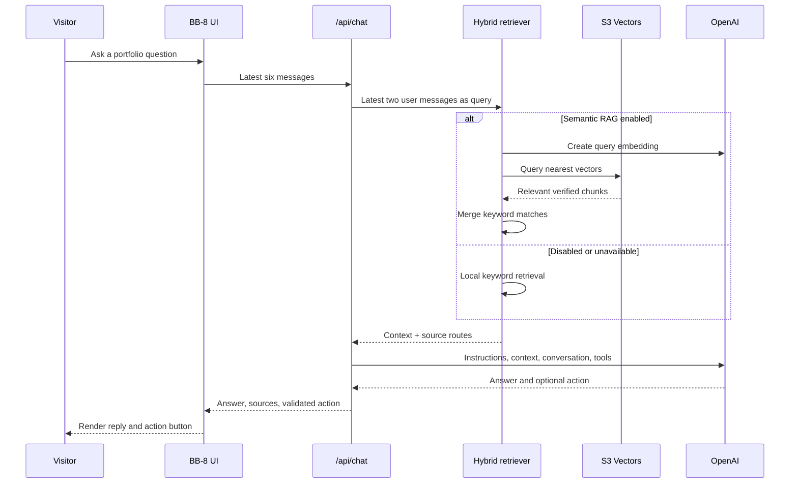
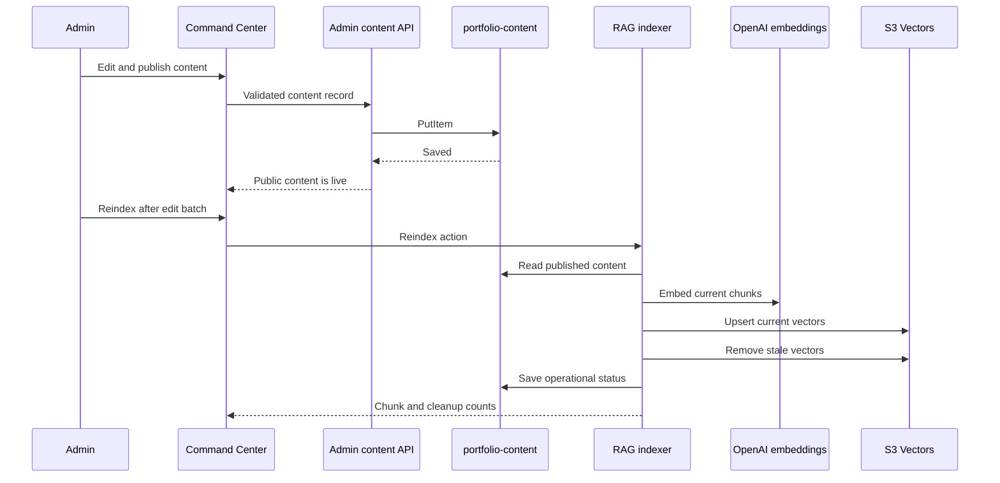

# System Architecture

## Overview

My portfolio is a Next.js 16 application deployed primarily as an AWS Amplify SSR application. It combines public portfolio pages, BB-8’s retrieval-augmented chat, a private Command Center I operate, two DynamoDB tables, Amazon S3 Vectors, first-party analytics, and selected external APIs.



## Application boundaries



Client components handle animation and interaction. Server route handlers validate untrusted input, keep credentials private, access AWS services, and call external APIs. Admin data mutations are never performed directly from the browser against AWS.

## Component architecture references

This document describes how the complete application fits together. Detailed subsystem configuration and flows are maintained separately:

| Subsystem | Detailed reference |
|---|---|
| AWS delivery, compute role, DynamoDB, S3 Vectors, DNS | [AWS Infrastructure](AWS_INFRASTRUCTURE.md) |
| Corpus, chunking, indexing, hybrid retrieval, generation, tools | [BB-8 RAG System](RAG.md) |
| Analytics tiers, attributes, traffic sources, engagement, dashboard | [Visitor Analytics](ANALYTICS.md) |
| Project and experience models, publishing, fallback, RAG sync | [Live Content System](CONTENT_SYSTEM.md) |
| Authentication, secrets, validation, privacy, limitations | [Security Model](SECURITY.md) |

## BB-8 request flow



The server limits message count and total characters, validates tool arguments, and never allows BB-8 to submit the contact form. Navigation and form-prefill actions execute in the visitor’s browser after validation.

## Content publishing and RAG synchronization



Content publishing and vector indexing are deliberately separate. This lets an administrator make several edits and pay for one embedding pass rather than embedding every intermediate draft.

## DynamoDB design

Two tables separate public messages from portfolio operations.

### `portfolio-contacts`

Primary key: `id`.

Stores visitor-provided first name, last name, email, message, submission time, read state, and optional sender classification.

### `portfolio-content`

Composite primary key: `pk` and `sk`.

| Partition key pattern | Sort key pattern | Purpose |
|---|---|---|
| `CONTENT#PROJECTS` | `ITEM#<id>` | Project records |
| `CONTENT#EXPERIENCE` | `ITEM#<id>` | Experience records |
| `SETTINGS` | `RAG` | Safe runtime retrieval settings |
| `STATUS` | `RAG` | Last index-operation status |
| `MANDATORY_EVENT#<eventHash>` | `SUMMARY` | Idempotent anonymous visitor/session event with country/region |
| `MANDATORY_VISITORS#YYYY-MM-DD` | `<locationHash>#<visitorHash>` | Daily mandatory unique-visitor deduplication |
| `OP_EVENT#<eventHash>` | `SUMMARY` | Basic page-view or controlled feature event and optional engagement duration |
| `ANALYTICS#YYYY-MM-DD` | `GEO#<hash>` | Mandatory country/region visitor and visit aggregate |
| `ANALYTICS#YYYY-MM-DD` | `PAGE#<path>` | Daily page views, engagement, and enhanced-session totals |
| `ANALYTICS#YYYY-MM-DD` | `CONTEXT#<hash>` | Daily coarse device, viewport, location, and source aggregates |
| `ANALYTICS#YYYY-MM-DD` | `CHAT#SUMMARY` and `CHAT_*` | BB-8 adoption, reliability, token, action, retrieval, model, and context aggregates |
| `ANALYTICS_CHAT_EVENT#<eventHash>` | `OPEN` or `REQUEST` | Purpose-limited BB-8 telemetry without conversation text |
| `ANALYTICS_CHAT_SESSIONS#YYYY-MM-DD` | `<sessionHash>` | Daily anonymous BB-8 session deduplication |
| `ANALYTICS_SESSION#YYYY-MM-DD` | `<path>#<hash>` | Basic daily page-session deduplication records |
| `ANALYTICS_VISITS#YYYY-MM-DD` | `<startedAt>#<visitHash>` | Recent-visit index for the admin dashboard |
| `VISITOR#<visitorHash>` | `PROFILE` | Pseudonymous first/last-seen time, visit counter, and optional audience segment I assign |
| `VISITOR#<visitorHash>` | `VISIT#<visitHash>` | Numbered visit summary, coarse context, and timestamps |
| `VISITOR#<visitorHash>` | `VISIT#<visitHash>#EVENT#<time>#<event>` | Timestamped public-page activity |

Analytics items include `expiresAt`, managed by DynamoDB TTL. Defaults are 90 days for mandatory and BB-8 telemetry, 180 days for Basic and Enhanced Analytics, and 365 days for contacts; environment variables can change each category. Browser UUIDs are SHA-256 hashed before storage. CloudFront supplies coarse country/region values; my application never persists raw IP, city, county, postal code, coordinates, or a device fingerprint.

## Visitor analytics flow

```mermaid
sequenceDiagram
    participant V as Visitor browser
    participant T as TrafficTracker
    participant A as /api/analytics
    participant D as portfolio-content
    participant C as Admin Command Center

    V->>T: Open a public page
    T->>A: Random visitor UUID + session UUID
    A->>A: Allow-list country/region; discard IP
    A->>D: Mandatory event + reach aggregate
    alt Optional analytics disabled or privacy signal
      T-->>V: No page/device/journey event
    else Explicit Basic or Enhanced consent
      T->>A: Path/feature, event UUID, coarse client hints
      A->>A: Derive coarse country, device, OS, and browser
      A->>D: Isolated event, aggregate counters, engagement duration
      opt Explicit Enhanced consent
        T->>T: Persist random visitor ID; create/reuse visit ID
        T->>A: Hashed-identifier inputs and broad traffic source
        A->>D: Numbered visit and timestamped page sequence
      end
      C->>D: Protected aggregate and journey queries
      D-->>C: UX metrics and optional visitor journeys
      C->>D: Optional manual audience classification
    end
```

Mandatory measurement is cookieless and creates only a random session-scoped visitor/session identity plus country/region. Basic page/device/feature and BB-8 telemetry are explicit opt-ins. Enhanced measurement is a separate explicit opt-in that persists the random browser identifier and adds visit numbering, route sequences, and broad traffic-source categories. Audience classifications such as recruiter or technical peer are assigned manually in the Command Center; geography and device data never infer them automatically.

Enhanced traffic source uses the browser referrer and stores only an allow-listed category plus validated hostname. Complete URLs, query parameters, search terms, and UTM values are not retained. Basic events have no traffic-source field and appear as Basic measurement in dashboard source totals.

## Data ownership

| Data | Controller/source | Storage | Public exposure |
|---|---|---|---|
| Stable portfolio facts | Source-controlled knowledge | Repository bundle | Through pages and grounded chat |
| Live projects/experience | Me | `portfolio-content` | Published records only |
| Contact messages | Visitor submission | `portfolio-contacts` | Never public |
| RAG settings/status | Me / application | `portfolio-content` | Protected admin only |
| Vectorized chunks | Indexer | S3 Vectors | Returned only through grounded server retrieval |
| Mandatory reach | Random session identity plus CloudFront-derived country/region | Events and aggregates in `portfolio-content` | Protected admin only |
| Optional basic analytics | First-party tracker | Aggregates in `portfolio-content` | Protected admin only |
| Enhanced journeys | Consenting browser | Pseudonymous records in `portfolio-content` | Protected admin only |
| BB-8 usage telemetry | Chat UI and server route | Aggregates in `portfolio-content` | Protected admin only |
| OpenAI usage/cost report | OpenAI organization APIs | Five-minute process-memory cache only | Protected admin only |
| Chat transcript | Visitor browser | Same-tab `sessionStorage` | Visible only in that browser tab |

## Authentication and trust boundaries

1. I submit `ADMIN_KEY` to `/api/admin/session`.
2. The server uses constant-time comparison and issues a signed eight-hour session cookie.
3. The cookie is `HttpOnly`, `SameSite=Strict`, and `Secure` in production.
4. Protected APIs validate the signature and expiration on every request.
5. All content fields, URLs, enums, IDs, arrays, and analytics paths are validated server-side.

This model is appropriate for my single-admin workflow. If I expand administration to multiple users, I should replace it with Cognito or another identity provider and role-based authorization.

## Failure behavior

| Failure | Behavior |
|---|---|
| Content table unavailable | Public pages and local retrieval use bundled defaults |
| S3 Vectors unavailable | BB-8 uses local keyword retrieval |
| OpenAI unavailable | Chat returns a temporary-service error; portfolio navigation still works normally |
| GitHub API unavailable | Social GitHub cards show their error/fallback state |
| Analytics table unavailable | Tracking is accepted as a no-op and never blocks navigation |
| GitHub Pages mirror | Server-only contact, chat, live content, and analytics features are unavailable or degraded by design |

## Deployment topology

- `main` pushes trigger the primary Amplify build.
- `amplify.yml` exposes the allow-listed server environment variables to Next.js through `.env.production`.
- Route 53 maps `adityamore.dev` to Amplify.
- The optional GitHub Pages deployment uses `NEXT_PUBLIC_GITHUB_PAGES=true`, static export settings, unoptimized images, and API-route stubs.
- No secrets are committed; `.env.local` and generated production environment files remain ignored.
