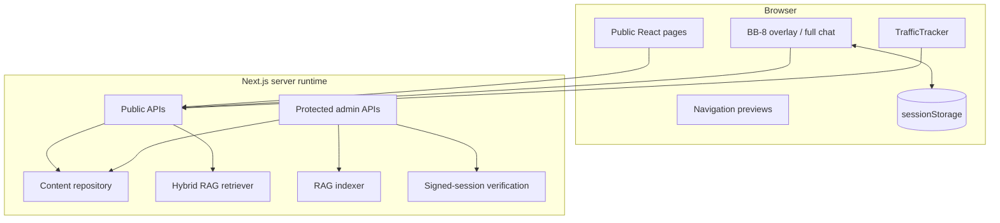
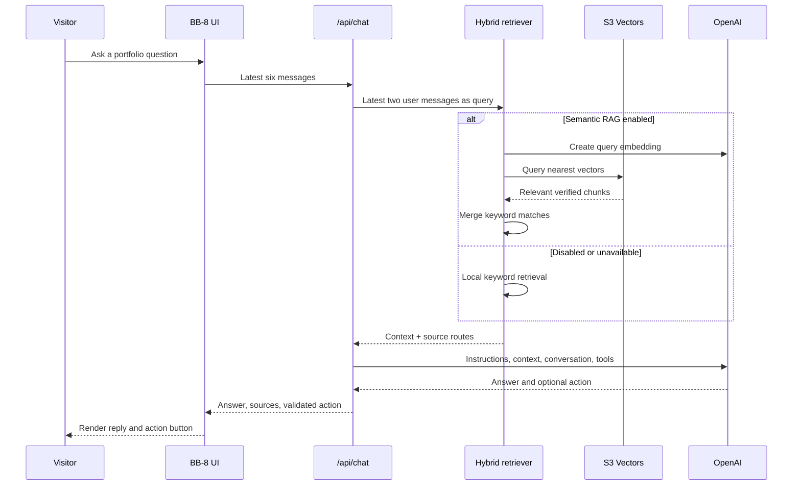
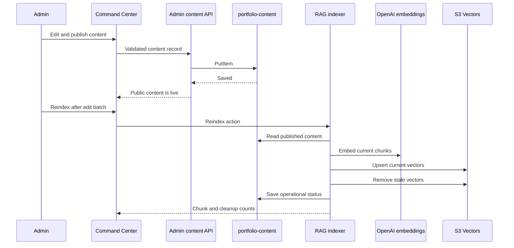

# System Architecture

## Overview

The portfolio is a Next.js 16 application deployed primarily as an AWS Amplify SSR application. It combines public portfolio pages, BB-8’s retrieval-augmented chat, a private owner-operated Command Center, two DynamoDB tables, Amazon S3 Vectors, and selected external APIs.

```mermaid
flowchart LR
    Visitor([Visitor])
    Admin([Aditya / Admin])
    GitHubRepo[(GitHub repository)]

    subgraph AWS[AWS]
      R53[Route 53]
      Amplify[AWS Amplify\nCI/CD + Next.js SSR]
      Contacts[(DynamoDB\nportfolio-contacts)]
      Operations[(DynamoDB\nportfolio-content)]
      Vectors[(Amazon S3 Vectors\nportfolio-knowledge)]
    end

    subgraph NextApp[Next.js application]
      Public[Public pages]
      Chat[/api/chat]
      ContentAPI[/api/content/*]
      ContactAPI[/api/contact]
      AnalyticsAPI[/api/analytics]
      AdminUI[Admin Command Center]
      AdminAPI[/api/admin/*]
      GitHubAPI[/api/github]
    end

    OpenAI[OpenAI API\nresponses + embeddings]
    GitHub[GitHub REST API]
    Mirror[GitHub Pages\nstatic mirror]

    Visitor --> R53 --> Amplify --> Public
    Public --> ContentAPI --> Operations
    Public --> AnalyticsAPI --> Operations
    Visitor --> Chat --> Vectors
    Chat --> OpenAI
    Visitor --> ContactAPI --> Contacts
    Public --> GitHubAPI --> GitHub

    Admin --> AdminUI --> AdminAPI
    AdminAPI --> Contacts
    AdminAPI --> Operations
    AdminAPI --> Vectors
    AdminAPI --> OpenAI

    GitHubRepo -->|push main| Amplify
    GitHubRepo -. manual static deployment .-> Mirror
```

## Application boundaries



Client components handle animation and interaction. Server route handlers validate untrusted input, keep credentials private, access AWS services, and call external APIs. Admin data mutations are never performed directly from the browser against AWS.

## BB-8 request flow



The server limits message count and total characters, validates tool arguments, and never allows BB-8 to submit the contact form. Navigation and form-prefill actions execute in the visitor’s browser after validation.

## Content publishing and RAG synchronization



Content publishing and vector indexing are deliberately separate. This lets an administrator make several edits and pay for one embedding pass rather than embedding every intermediate draft.

## DynamoDB design

Two tables separate public messages from portfolio operations.

### `portfolio-contacts`

Primary key: `id`.

Stores visitor-provided first name, last name, email, message, submission time, read state, and optional sender classification.

### `portfolio-content`

Composite primary key: `pk` and `sk`.

| Partition key pattern | Sort key pattern | Purpose |
|---|---|---|
| `CONTENT#PROJECTS` | `ITEM#<id>` | Project records |
| `CONTENT#EXPERIENCE` | `ITEM#<id>` | Experience records |
| `SETTINGS` | `RAG` | Safe runtime retrieval settings |
| `STATUS` | `RAG` | Last index-operation status |
| `ANALYTICS#YYYY-MM-DD` | `PAGE#<path>` | Daily views and unique page sessions |
| `ANALYTICS_SESSION#YYYY-MM-DD` | `<path>#<hash>` | Anonymous daily deduplication records |

Analytics items include `expiresAt`, which is managed by DynamoDB TTL.

## Authentication and trust boundaries

1. The owner posts `ADMIN_KEY` to `/api/admin/session`.
2. The server uses constant-time comparison and issues a signed eight-hour session cookie.
3. The cookie is `HttpOnly`, `SameSite=Strict`, and `Secure` in production.
4. Protected APIs validate the signature and expiration on every request.
5. All content fields, URLs, enums, IDs, arrays, and analytics paths are validated server-side.

This model is appropriate for one owner. A multi-user administration product should replace it with Cognito or another identity provider and role-based authorization.

## Failure behavior

| Failure | Behavior |
|---|---|
| Content table unavailable | Public pages and local retrieval use bundled defaults |
| S3 Vectors unavailable | BB-8 uses local keyword retrieval |
| OpenAI unavailable | Chat returns a temporary-service error; portfolio navigation still works normally |
| GitHub API unavailable | Social GitHub cards show their error/fallback state |
| Analytics table unavailable | Tracking is accepted as a no-op and never blocks navigation |
| GitHub Pages mirror | Server-only contact, chat, live content, and analytics features are unavailable or degraded by design |

## Deployment topology

- `main` pushes trigger the primary Amplify build.
- `amplify.yml` exposes the allow-listed server environment variables to Next.js through `.env.production`.
- Route 53 maps `adityamore.dev` to Amplify.
- The optional GitHub Pages deployment uses `NEXT_PUBLIC_GITHUB_PAGES=true`, static export settings, unoptimized images, and API-route stubs.
- No secrets are committed; `.env.local` and generated production environment files remain ignored.
