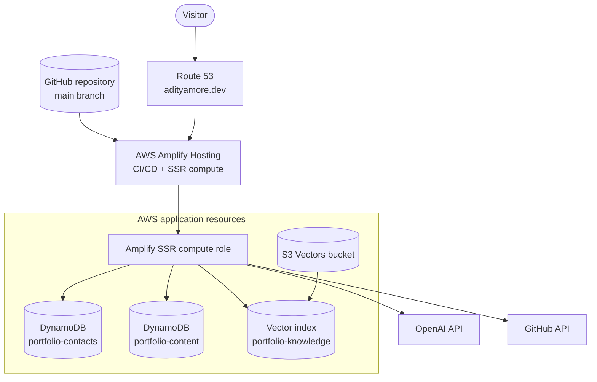

# AWS Infrastructure

## Purpose

AWS provides the portfolio’s production delivery, server runtime, operational storage, vector retrieval, identity boundary, and DNS. The architecture is intentionally serverless and request-driven so the application can support portfolio traffic without continuously running compute.

## Resource topology



## Resource inventory

| Resource | Application responsibility | Configuration reference |
|---|---|---|
| AWS Amplify Hosting | Builds `main`, serves the Next.js application, and runs dynamic route handlers | `amplify.yml` |
| Route 53 | Maps `adityamore.dev` to the Amplify application | AWS-managed DNS records |
| Amplify compute role | Supplies temporary AWS credentials to SSR route handlers | App settings → IAM roles |
| `portfolio-contacts` | Stores visitor-submitted contact messages | `DYNAMODB_CONTACTS_TABLE` |
| `portfolio-content` | Stores live content, RAG settings/status, and analytics | `DYNAMODB_PORTFOLIO_TABLE` |
| S3 Vectors bucket | Owns the vector index namespace | `RAG_VECTOR_BUCKET` |
| `portfolio-knowledge` index | Stores embedded portfolio chunks and metadata | `RAG_VECTOR_INDEX` |
| CloudFront-managed edge layer | Delivers Amplify content and supplies IP-derived country/region headers when available | Managed by Amplify |

## Amplify build and runtime

`main` is the production branch. Amplify installs the locked dependency graph, runs the production Next.js build, publishes `.next`, and provisions the managed SSR runtime used by dynamic route handlers.

`amplify.yml` copies an allow-listed set of deployment variables into `.env.production` during the build. The allow list covers:

- `ADMIN_KEY` and `ADMIN_SESSION_SECRET`
- `APP_AWS_*`
- `DYNAMODB_*`
- `GITHUB_TOKEN`
- `OPENAI_*`
- `RAG_*`
- `NEXT_PUBLIC_*`

Only intentionally public values use the `NEXT_PUBLIC_` prefix. Server secrets must never use it because Next.js can include those values in browser JavaScript.

`OPENAI_API_KEY` serves BB-8 generation and embeddings. The separate `OPENAI_ADMIN_KEY` is optional and grants the private Command Center read access to OpenAI organization usage/cost reporting. `OPENAI_PROJECT_ID` is recommended to restrict that report to BB-8’s dedicated OpenAI project. Neither key may use a `NEXT_PUBLIC_` prefix.

The application’s AWS clients use `APP_AWS_REGION`, defaulting to `us-east-1`. Explicit `APP_AWS_ACCESS_KEY_ID` and `APP_AWS_SECRET_ACCESS_KEY` values take precedence when present, but production is designed to omit them and use the Amplify compute role’s temporary credentials.

## IAM model

The Amplify service role used for build or logging is distinct from the SSR compute role used by application requests. Runtime permissions belong on the compute role.

The portfolio table requires:

```json
{
  "Effect": "Allow",
  "Action": [
    "dynamodb:BatchGetItem",
    "dynamodb:GetItem",
    "dynamodb:PutItem",
    "dynamodb:DeleteItem",
    "dynamodb:UpdateItem",
    "dynamodb:Query"
  ],
  "Resource": "arn:aws:dynamodb:REGION:ACCOUNT_ID:table/portfolio-content"
}
```

The contacts table additionally uses `dynamodb:Scan` for the private inbox:

```json
{
  "Effect": "Allow",
  "Action": [
    "dynamodb:GetItem",
    "dynamodb:PutItem",
    "dynamodb:DeleteItem",
    "dynamodb:UpdateItem",
    "dynamodb:Scan"
  ],
  "Resource": "arn:aws:dynamodb:REGION:ACCOUNT_ID:table/portfolio-contacts"
}
```

BB-8 runtime retrieval requires `s3vectors:QueryVectors` and `s3vectors:GetVectors` on the configured vector index. RAG status and reindex operations also require `s3vectors:ListVectors`, `s3vectors:PutVectors`, and `s3vectors:DeleteVectors`. Resource-creation permissions are intentionally separate from the normal runtime policy.

The one-time `npm run content:setup` provisioning identity also needs `dynamodb:DescribeTable`, `dynamodb:DescribeTimeToLive`, and `dynamodb:UpdateTimeToLive` for both tables (plus `CreateTable` when provisioning the content table). These control-plane actions are not required by the Amplify SSR runtime role after TTL is enabled.

The vector index resource follows this ARN shape:

```text
arn:aws:s3vectors:REGION:ACCOUNT_ID:bucket/BUCKET_NAME/index/INDEX_NAME
```

The runtime statement is scoped to that index rather than all vector buckets in the account.

## DynamoDB configuration

Both tables use on-demand billing.

### Contacts table

- Partition key: `id` (string)
- No sort key
- Workload: low-volume contact writes and private inbox scans
- Privacy lifecycle: `expiresAt` defaults to 365 days and remains configurable

### Portfolio operations table

- Partition key: `pk` (string)
- Sort key: `sk` (string)
- TTL attribute: `expiresAt`
- Workloads: content CRUD, RAG settings/status, mandatory country/region telemetry, consented analytics/journeys, and purpose-limited BB-8 telemetry

The complete key design appears in [System Architecture](ARCHITECTURE.md#dynamodb-design). Centralized TTL defaults are 90 days for mandatory and BB-8 telemetry, 180 days for Basic and Enhanced Analytics, and 365 days for contacts. Each period is configurable. TTL deletion is asynchronous, so expiry time is an eligibility boundary rather than an exact removal timestamp.

## S3 Vectors configuration

The vector index uses:

| Property | Value |
|---|---|
| Data type | `FLOAT32` |
| Distance metric | Cosine |
| Default dimensions | 1,024 |
| Default embedding model | `text-embedding-3-small` |
| Non-filterable metadata | `content` |
| Stored metadata | document ID, title, section, route, content, embedding model |

Embedding dimensions must match the index dimension. Changing either the embedding model’s output dimensions or the distance metric requires a compatible index and complete reindex.

## Request-to-resource mapping

```mermaid
flowchart LR
    PublicContent[/api/content/*] --> Portfolio
    Chat[/api/chat] --> Portfolio
    Chat --> VectorIndex
    Chat --> OpenAI
    Contact[/api/contact] --> Contacts
    Analytics[/api/analytics] --> Portfolio
    Admin[/api/admin/*] --> Portfolio
    Admin --> Contacts
    Admin --> VectorIndex
    Admin --> OpenAI
```

All AWS calls originate in server route handlers or server libraries. Browser code never receives AWS credentials and never writes directly to DynamoDB or S3 Vectors.

## Coarse location headers

The analytics route reads `CloudFront-Viewer-Country`, `CloudFront-Viewer-Country-Name`, `CloudFront-Viewer-Country-Region-Name`, and `CloudFront-Viewer-Country-Region`, with compatible Vercel country/region fallbacks outside AWS. I do not configure or read `CloudFront-Viewer-City`. If infrastructure supplies city, county, postal code, coordinates, or another precise field anyway, application code ignores it. Request handlers transform the transient address into a short-lived one-way rate-limit key; neither value is copied to DynamoDB or used as visitor identity.

After deployment, I verify that the SSR route receives only the required country/region viewer headers. Missing values remain unknown; I do not send the IP to a third-party fallback geolocation service. I run `npm run analytics:purge-city` once with intended AWS credentials to remove historical city attributes created by the previous data model.

## Failure isolation

| Dependency failure | Application behavior |
|---|---|
| Amplify environment variable unavailable | The dependent route returns a safe configuration/service error |
| `portfolio-content` unavailable | Public content and local RAG use bundled defaults |
| `portfolio-contacts` unavailable | Contact submission fails without affecting other pages |
| S3 Vectors unavailable | BB-8 falls back to deterministic keyword retrieval |
| OpenAI unavailable | Chat reports temporary unavailability; navigation remains functional |
| GitHub API unavailable | GitHub cards render a retry/fallback state |
| Analytics write unavailable | The event is accepted as a no-op and never blocks navigation |

## Static continuity mirror

GitHub Pages receives a static export with a repository base path, unoptimized images, and API route stubs. It is a continuity surface rather than a second production backend. Contact submission, live content mutation, analytics, admin operations, and OpenAI-backed chat require the Amplify SSR deployment.

## Operational ownership

- Infrastructure or role changes must be reflected in this document and [Security Model](SECURITY.md).
- DynamoDB key changes must also update [System Architecture](ARCHITECTURE.md) and [Visitor Analytics](ANALYTICS.md) where applicable.
- RAG index changes must update [BB-8 RAG System](RAG.md).
- Production delivery changes must update [Pull Requests and Release Checks](PULL_REQUESTS.md).
