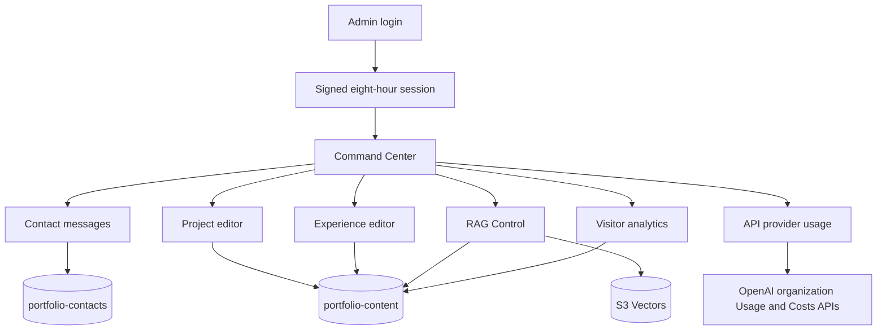

# Portfolio Command Center

## Purpose

The private `/admin` area is my operational control plane for live content, contact messages, BB-8 retrieval, visitor analytics, and OpenAI usage/cost monitoring. It is intentionally designed for my single-admin workflow and uses the same light/dark visual language as the public site.

## Functional map

Public navigation, footer, and BB-8 chrome are suppressed below `/admin`; authorization is still enforced independently by every protected API.

## Authentication

The login route validates `ADMIN_KEY` with constant-time comparison and exchanges it for a signed session cookie. The cookie is:

- Valid for eight hours.
- `HttpOnly` so browser JavaScript cannot read it.
- `SameSite=Strict` to reduce cross-site request exposure.
- `Secure` in production.
- Signed with `ADMIN_SESSION_SECRET`, falling back to `ADMIN_KEY` only when the dedicated secret is absent.

The raw key is not stored in browser storage. The legacy `x-admin-key` header is still recognized for controlled automation and compatibility.

Login attempts are protected by an in-memory, per-IP limit. Because the portfolio uses managed serverless compute, this is a lightweight process-local control rather than a distributed identity or lockout system.

## Dashboard

The main dashboard provides direct access to each operational area and presents the purpose of the underlying system. It does not expose AWS credentials, OpenAI secrets, raw database operations, or arbitrary resource names.

## Contact messages

The inbox reads from `portfolio-contacts` and supports:

- Message search and filtering.
- Read/unread state.
- Manual sender classification as recruiter, visitor, friend, or test.
- Permanent deletion.
- Direct reply actions through my email client.
- An analytics visitor reference and journey shortcut when the sender had already enabled enhanced analytics.

Contact sender classification remains separate from analytics audience classification. When enhanced analytics is active, the contact client includes the existing random visitor UUID; the server immediately hashes it and stores only the 12-character analytics reference plus its full hash with the message. This deliberate link lets me open the related consented journey. Basic and essential-only visitors do not receive a persistent identifier and their messages remain unlinked.

## Projects

The project editor manages title, descriptions, highlights, technologies, year, status, links, ordering, featured placement, and draft/published state. Published records feed the Projects page and featured records feed the About page.

All fields are normalized by the server. URLs must be application-relative or HTTPS, statuses are allow-listed, arrays and text are bounded, and IDs are safe slugs.

## Experience

The experience editor manages organization metadata, role details, period, location, summaries, research areas, contributions, tags, logo, accent, ordering, About-timeline placement, and draft/published state.

Published records feed the Experience page; `showOnTimeline` selects the About-page timeline subset.

The content data model, consistency behavior, and DynamoDB keys are documented in [Live Content System](CONTENT_SYSTEM.md).

## RAG Control

RAG Control separates safe runtime settings from index-compatible infrastructure settings.

Runtime controls stored in DynamoDB:

- Semantic retrieval enabled/disabled.
- `topK`, bounded from 1 to 10.
- Maximum cosine distance, bounded from 0 to 2.

Read-only infrastructure status:

- Vector bucket configured/reachable state.
- Index name.
- Embedding model and dimensions.
- Current vector count.
- Last reindex state and result.

The deliberate **Reindex published content** operation rebuilds the current corpus, creates embeddings, upserts vectors, removes stale vector keys, and records running/ready/error status. Saving content does not trigger this operation automatically.

See [BB-8 RAG System](RAG.md) for the retrieval and indexing architecture.

## Traffic analytics

The Traffic dashboard separates mandatory anonymous visitor/session reach from consented UX measurement, the smaller Enhanced journey sample, and consented first-party BB-8 telemetry.

It provides:

- Page views, average engaged time, returning visits, and journey coverage.
- Daily mandatory visitors and visits for 7, 30, or 90 days, with consented page views shown as context.
- Mandatory country/region counts plus optional device, viewport, operating-system, browser, and Enhanced traffic-source breakdowns.
- Controlled Basic feature-event totals for projects, demos, external links, and contact-form starts/submissions.
- Route-level views, enhanced sessions, and average engagement.
- Sortable page performance plus searchable/sortable visitor journeys.
- Recent enhanced visits with visit number, time, coarse context, source, and route timeline.
- Manual audience labels: unclassified, recruiter, hiring manager, technical peer, student, or general visitor.
- BB-8 opens, anonymous sessions, requests, success/failure, latency, token counts, retrieval fallback, and agent-action counts without prompt or response text.

Audience labels are annotations I apply manually. Location, device, source, and page behavior never perform automated classification.

Random session-scoped visitor/session identity and country/region measurement are mandatory and cookieless. Page/device/BB-8 measurement requires Basic or Enhanced consent; cross-session recognition, source, and journeys require Enhanced consent. The complete model is documented in [Visitor Analytics](ANALYTICS.md).

## API usage providers

The API Usage area is a provider hub so additional AI APIs can receive isolated dashboards later. Its OpenAI card includes the OpenAI logo, connection state, and a dedicated dashboard that reads OpenAI’s organization Usage and Costs APIs through the protected server route. It displays:

- Completion and embedding request totals.
- Input, output, cached-input, and total token volume.
- Daily request and cost activity.
- Usage grouped by model.
- Cost grouped by OpenAI line item.

`OPENAI_ADMIN_KEY` is a server-only organization Admin API key used only for this report. `OPENAI_PROJECT_ID` is strongly recommended so the results represent the dedicated BB-8 project instead of the full OpenAI organization. The browser never receives either value. Results are cached in server memory for five minutes and OpenAI reporting can lag behind the near-real-time first-party BB-8 counters on the Traffic page.

## Data and API boundaries

| Area | Table/resource | Protected API |
|---|---|---|
| Messages | `portfolio-contacts` | `/api/contact` admin methods |
| Projects | `portfolio-content` | `/api/admin/content/projects` |
| Experience | `portfolio-content` | `/api/admin/content/experience` |
| RAG settings/status | `portfolio-content` | `/api/admin/rag` |
| Vector synchronization | S3 Vectors + OpenAI | `/api/admin/rag` reindex action |
| Traffic report/classification | `portfolio-content` | `/api/admin/analytics` |
| OpenAI requests/tokens/costs | OpenAI organization APIs | `/api/admin/openai-usage` |

Browser components call these APIs; they never connect directly to AWS. Every mutation is authenticated and server-validated.

## AWS dependencies

The Command Center depends on the Amplify SSR compute role and the same application resources as public server routes. Its DynamoDB workload uses `BatchGetItem`, `GetItem`, `PutItem`, `DeleteItem`, `UpdateItem`, `Query`, and contacts-table `Scan`. RAG status and reindex controls require vector read/write/list/delete access and OpenAI embedding access.

The complete least-privilege split is maintained in [AWS Infrastructure](AWS_INFRASTRUCTURE.md).

## Failure behavior

| Failure | Command Center behavior |
|---|---|
| Invalid/expired session | Protected routes return `401`; UI returns to login |
| Content table unavailable | Editors and operational reports show an unavailable state; public pages retain bundled fallbacks |
| Contacts table unavailable | Inbox or message mutations fail independently |
| Vector service unavailable | Status reports an error and reindex records failure; public chat can fall back locally |
| OpenAI unavailable during reindex | Reindex records an error without changing public content |
| OpenAI Admin API key absent/invalid | OpenAI provider dashboard shows setup or connection guidance; BB-8 continues using its separate project API key |
| Analytics query unavailable | Traffic page shows an unavailable state without affecting public navigation |

## Scope limit

This is not a multi-tenant CMS. It has no role hierarchy, collaborative editing, approval workflow, revision history, or per-user audit log. A future multi-operator system should replace the shared-key session model with managed identity and role-based authorization.
