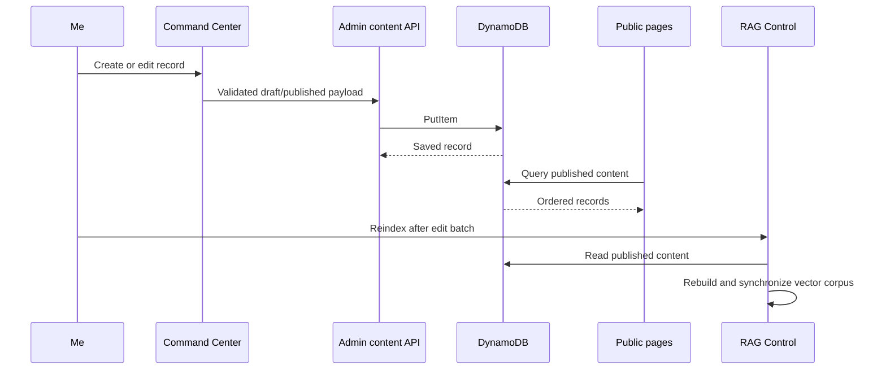

# Live Content System

## Purpose

I manage projects and experience as live structured records so I can publish changes without editing presentation components. The same records feed public pages and the next BB-8 knowledge-index operation.

## Architecture

```mermaid
flowchart LR
    Me([Me / Admin]) --> Admin[Command Center editor]
    Admin --> API[/api/admin/content/*]
    API --> Validate[Content validation]
    Validate --> Table[(DynamoDB\nportfolio-content)]

    PublicAPI[/api/content/*] --> Repository[Content repository]
    Repository --> Table
    Repository -. unavailable or empty .-> Defaults[Bundled defaults]
    Repository --> Pages[About, Projects, Experience]
    Repository --> Corpus[Current RAG corpus]
    Corpus --> Index[RAG reindex operation]
```

## Source-of-truth model

- DynamoDB is the live source after records exist for a content type.
- `lib/content/defaults.ts` is the resilience fallback and initial seed source.
- Public reads include only records where `published` is true.
- Admin reads include drafts and published records.
- Records are sorted by `sortOrder` before rendering or indexing.
- Static profile facts, education, skills, and selected source-controlled case studies remain outside the live content table.

An empty or unavailable content partition does not produce an empty public site; the repository returns the bundled defaults instead.

## DynamoDB keys

| Content type | Partition key | Sort key |
|---|---|---|
| Projects | `CONTENT#PROJECTS` | `ITEM#<id>` |
| Experience | `CONTENT#EXPERIENCE` | `ITEM#<id>` |

The table uses `pk` and `sk` string keys with on-demand billing. Content records do not use analytics TTL.

## Project model

Project records include:

- Stable slug-like ID and title.
- Short blurb and full description.
- Highlights and technology tags.
- Year and status: completed, in progress, or planned.
- Featured flag for the About page.
- Optional HTTPS or application-relative source, demo, and detail links.
- Published state and display order.
- Created and updated timestamps.

## Experience model

Experience records include:

- Stable ID, title, organization, department, and optional subdepartment.
- Period, location, and role type.
- Optional summary and research areas.
- Contribution bullets and technology/research tags.
- Visual accent and optional logo URL.
- `showOnTimeline` control for the About-page timeline.
- Published state, display order, and timestamps.

## Validation boundary

`lib/content/validation.ts` normalizes all admin payloads before persistence:

- Text values are trimmed and length-limited.
- Arrays are item-count and item-length limited.
- IDs are converted to safe lowercase slugs.
- Project status and experience accent use allow-listed enums.
- URLs must be application-relative or HTTPS.
- Numeric display order and project year are bounded.
- Experience requires title, organization, and period.

The API route selects the content kind from an allow list and rejects incomplete records. Browser form constraints improve usability, but server validation remains authoritative.

## Publishing lifecycle



Publishing does not automatically call OpenAI. I can make a batch of related edits, verify the public output, and run one RAG reindex. This prevents unnecessary embedding requests and avoids indexing intermediate drafts.

Deleting a live content record removes it from public reads immediately. Its vector remains until the next reindex, when stale vector keys are removed.

## Public consumers

| Consumer | Project data | Experience data |
|---|---|---|
| About page | Featured records | `showOnTimeline` records |
| Projects page | Full published catalog | — |
| Experience page | — | Full published timeline/details |
| Navigation previews | Summary content where implemented | Summary content where implemented |
| BB-8 local retrieval | Current published records | Current published records |
| S3 Vectors index | Included at reindex | Included at reindex |

## Failure and consistency behavior

- A missing table, missing partition, or DynamoDB read failure falls back to bundled data.
- A failed admin write returns an error and does not alter bundled defaults.
- Public rendering and semantic indexing are eventually consistent with each other because indexing is deliberate rather than automatic.
- Local keyword retrieval builds from the current repository at request time, so it can reflect live published content before the vector index is refreshed.
- Draft records never appear in public APIs or the RAG corpus.

## Related documentation

- [Command Center](COMMAND_CENTER.md) describes my editing and operational surfaces.
- [BB-8 RAG System](RAG.md) describes corpus assembly and indexing.
- [AWS Infrastructure](AWS_INFRASTRUCTURE.md) describes the table and IAM role.
- [API Reference](API.md) defines the public and protected content routes.
