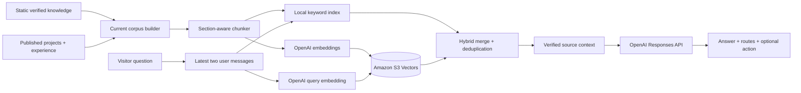
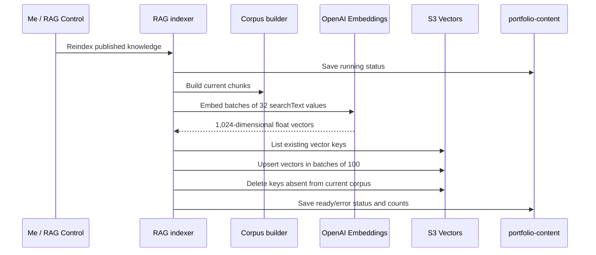

# BB-8 RAG System

## Purpose

BB-8 is the RAG-powered co-pilot for my Tech Portfolio. Retrieval constrains portfolio-specific answers to verified source material while still allowing a friendly conversational response and a small set of validated UI actions.

## End-to-end architecture

## Knowledge sources

The current corpus combines:

- Stable profile, education, skills, contact, and portfolio facts from `data/portfolio-knowledge.json`.
- Published project records from the live content repository.
- Published experience records from the live content repository.
- Selected source-controlled project case studies that remain outside the editable catalog.

`lib/rag/live-knowledge.ts` converts live records into structured knowledge documents. Draft content is excluded. If DynamoDB is unavailable, the content repository supplies bundled defaults, so both retrieval modes continue to operate against a complete portfolio baseline.

## Chunking

`lib/rag/knowledge.ts` performs deterministic section-aware chunking:

- Each chunk retains document ID, title, section heading, public route, and content.
- Content is normalized before splitting.
- Maximum chunk size is 1,200 characters.
- Long sections use a 160-character overlap.
- Sentence boundaries are preferred when a suitable boundary occurs after 60% of the maximum size.
- Stable keys follow `<document>-<section-slug>-<sequence>`.
- `searchText` combines title, section, and content for both embeddings and lexical scoring.

Stable chunk IDs allow the indexer to distinguish current vectors from stale vectors after content changes.

## Indexing pipeline

Each stored vector includes metadata for document ID, title, section, route, content, and embedding model. `content` is configured as non-filterable metadata because it is returned for grounding rather than used as an index filter.

Content saves do not trigger embeddings automatically. This lets me complete and review an edit batch before paying for and committing one vector synchronization. Local retrieval can reflect the new published content immediately; semantic retrieval becomes consistent after reindex.

## Query and hybrid retrieval

The chat route constructs the retrieval query from the latest two user messages. In semantic mode:

1. OpenAI creates a query embedding using the same model and dimensions as the index.
2. S3 Vectors returns the nearest vectors with distance and metadata.
3. Results beyond `maxDistance` are discarded.
4. The deterministic lexical retriever contributes up to two strong exact-topic matches.
5. Lexical and semantic results are deduplicated by chunk ID and limited to `topK`.

The lexical scorer tokenizes the question, removes stop words, expands portfolio concepts such as “career” to “experience/work/role,” weights rare terms, gives title and section matches three times the content weight, and rewards an exact normalized phrase.

The hybrid merge prevents broad semantic summary chunks from crowding out direct matches for pages such as Projects, Experience, Education, Skills, Contact, or Socials.

## Retrieval modes and fallback

| Condition | Result mode | Fallback reason |
|---|---|---|
| Semantic retrieval disabled | `local-keyword` | `disabled` |
| Missing bucket or OpenAI configuration | `local-keyword` | `missing-config` |
| Embedding or S3 query failure | `local-keyword` | `query-failed` |
| Successful vector query | `s3-vectors` | None |
| Evaluation explicitly requests local mode | `local-keyword` | `disabled` |

The API response reports retrieval mode, match count, elapsed milliseconds, and whether fallback occurred. Retrieval failures never prevent the public portfolio from rendering.

## Generation and grounding

`/api/chat` supplies the OpenAI Responses API with:

- Stable BB-8 identity, scope, style, grounding, and action policy.
- Only the retrieved verified chunks rather than the complete corpus.
- At most the latest six alternating user/assistant messages.
- A 5,000-character total conversation limit.
- Maximum output of 1,000 tokens for the initial answer.
- Low reasoning effort and medium text verbosity.
- `store: false`.

If no relevant chunk is retrieved, the prompt explicitly states that no verified source is available. BB-8 must acknowledge missing information instead of inventing a portfolio fact.

The UI renders unique source routes derived from retrieved chunks; BB-8 does not generate citation syntax itself.

## Co-pilot tools

The Responses API can select at most one strict tool per reply:

| Tool | Server validation | Browser effect |
|---|---|---|
| `navigate_portfolio` | Route and label allow lists | Opens the relevant portfolio page while the overlay remains live |
| `offer_resume` | Fixed action type and bounded label | Renders a download control for `/resume.pdf` |
| `prepare_contact_draft` | Bounded first name, last name, email, message, and label | Stores a same-tab draft and opens `/contact` for review |

Tool output is treated as untrusted until `actionFromToolCall` validates it. BB-8 cannot submit the contact form, send an email, choose an arbitrary URL, or perform more than one tool action in a response.

## Configuration

| Setting | Responsibility | Current behavior |
|---|---|---|
| `OPENAI_API_KEY` | Responses and embedding authorization | Server-only |
| `OPENAI_CHAT_MODEL` | Generation model | Defaults to `gpt-5.6-terra` |
| `OPENAI_EMBEDDING_MODEL` | Index/query embedding model | Defaults to `text-embedding-3-small` |
| `OPENAI_EMBEDDING_DIMENSIONS` | Vector width | Defaults to 1,024; must match the index |
| `RAG_ENABLED` | Deployment-level semantic toggle | Used when no runtime override exists |
| `RAG_VECTOR_BUCKET` | S3 Vectors bucket | Required for semantic retrieval/indexing |
| `RAG_VECTOR_INDEX` | Vector index | Defaults to `portfolio-knowledge` |
| `RAG_TOP_K` | Retrieved context count | Range 1–10; default 4 |
| `RAG_MAX_DISTANCE` | Cosine-distance cutoff | Range 0–2; lower is stricter |

The deployed distance baseline is 0.65. The code-level fallback is 0.60 when no value is supplied. `enabled`, `topK`, and `maxDistance` can be overridden from RAG Control and are stored at `SETTINGS / RAG` in DynamoDB. Model, dimensions, bucket, and index remain deployment-level because changing them affects index compatibility.

## S3 Vectors and IAM

The index uses `FLOAT32`, 1,024 dimensions, and cosine distance. Normal chat queries require:

- `s3vectors:QueryVectors`
- `s3vectors:GetVectors`

RAG Control status and reindex operations additionally require:

- `s3vectors:ListVectors`
- `s3vectors:PutVectors`
- `s3vectors:DeleteVectors`

Creation-time permissions—`CreateVectorBucket`, `GetVectorBucket`, `CreateIndex`, and `GetIndex`—are separate infrastructure permissions and are not required for ordinary chat requests. See [AWS Infrastructure](AWS_INFRASTRUCTURE.md) for the role boundary.

## Evaluation

The evaluation corpus contains 27 representative questions spanning availability, experience, research, education, projects, skills, contact information, and source-code discovery.

Both lexical and semantic evaluations report:

- Hit@3 against one or more expected routes.
- Mean retrieval latency.
- P95 retrieval latency.
- Per-question retrieved routes and pass/fail result.

The GitHub quality gate runs the deterministic local evaluation without AWS or OpenAI secrets. Semantic evaluation is an operational check after corpus, embedding, index, or distance-threshold changes.

## Operational status

RAG Control reads:

- Effective runtime settings.
- Whether the vector bucket is configured and reachable.
- Index name, embedding model, and dimensions.
- Current vector count.
- Last synchronization state, timestamps, counts, model, dimensions, bucket, index, or error message.

Status is stored at `STATUS / RAG` in the portfolio table. Reindex transitions it from `running` to `ready` or `error`.

## Related documentation

- [AWS Infrastructure](AWS_INFRASTRUCTURE.md) covers vector resources and permissions.
- [Live Content System](CONTENT_SYSTEM.md) covers the published records included in the corpus.
- [API Reference](API.md) covers the chat and protected RAG endpoints.
- [Security Model](SECURITY.md) covers prompt/tool trust boundaries and secret handling.
