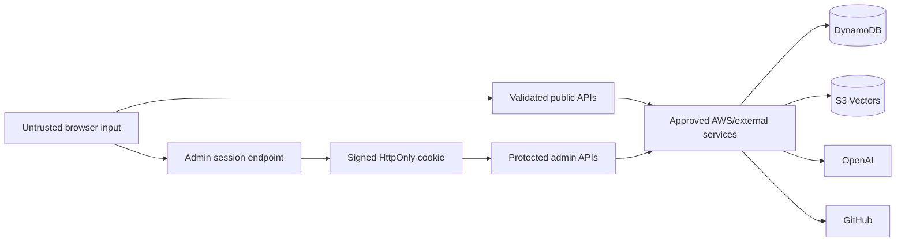

# Security Model

## Security objectives

The portfolio protects server credentials, private contact submissions, live content mutations, RAG operations, and analytics journeys while keeping the public application resilient when optional services fail.

## Trust boundaries

The browser is never trusted to authorize a mutation, determine an AWS resource, or validate a model-produced action. Route handlers and server libraries form the enforcement boundary.

## Admin authentication

1. I submit `ADMIN_KEY` to `POST /api/admin/session`.
2. The server compares it with constant-time `timingSafeEqual`.
3. A successful login receives a signed token containing an eight-hour expiration.
4. The token is stored in the `portfolio_admin_session` cookie.
5. The cookie is `HttpOnly`, `SameSite=Strict`, scoped to `/`, and `Secure` in production.
6. Every protected route verifies the signature and expiration.

The raw admin key is not stored in browser storage. `ADMIN_SESSION_SECRET` signs the cookie; if omitted, the implementation falls back to `ADMIN_KEY`. A dedicated signing secret is preferred because it separates login and session-signing responsibilities.

The legacy `x-admin-key` request header remains accepted for controlled automation and backward compatibility. It should not be used by public browser code.

This authentication model is intentionally designed for my single-admin workflow. It does not provide multiple identities, role-based access control, password recovery, or audit attribution. If I add those requirements, I will need a managed identity system such as Amazon Cognito.

## Rate limits

| Surface | Current protection |
|---|---|
| Admin login | Eight failed attempts per IP per ten-minute in-memory window |
| BB-8 chat | 20 requests per IP per one-minute in-memory window |
| Analytics | 120 events per IP per one-minute in-memory window and 4 KiB body cap |

These controls are process-local and reset when an Amplify compute instance is recycled. They reduce accidental or small-scale abuse but are not a distributed rate-limiting or web-application-firewall substitute.

Request IPs used for rate limiting remain in volatile memory and are not written to the application databases.

## Input validation

- Chat history has strict role, message-count, per-message length, and total-character limits.
- Model tools use strict JSON schemas and server-side allow lists for routes and action types.
- Contact drafts are length-limited and can only prefill the form; BB-8 cannot submit it.
- Contact submissions require all fields and a syntactically valid email address.
- Content mutations normalize text, arrays, enums, IDs, numbers, and URLs.
- Analytics accepts only public paths, known event types, bounded durations, UUID-shaped identifiers, and allow-listed source/audience values.
- Admin APIs independently verify authorization before reading or mutating protected data.

## Secret and AWS credential handling

- `OPENAI_API_KEY`, admin secrets, AWS credential overrides, and `GITHUB_TOKEN` are server-only.
- `NEXT_PUBLIC_*` is reserved for values intentionally exposed to the browser.
- Production AWS access is designed to use the Amplify SSR compute role and temporary credentials.
- Long-lived `APP_AWS_ACCESS_KEY_ID` and `APP_AWS_SECRET_ACCESS_KEY` values should be absent from Amplify when the compute role is attached and verified.
- IAM permissions are scoped to the two DynamoDB tables and configured S3 Vectors index.
- `.env.local` and generated `.env.production` files are excluded from version control.

Detailed resource policies and runtime mapping are maintained in [AWS Infrastructure](AWS_INFRASTRUCTURE.md).

## BB-8 safety boundary

BB-8 receives verified retrieved context plus a short conversation window. OpenAI requests use `store: false`. The application does not save chat transcripts server-side; the visible transcript remains in same-tab `sessionStorage`.

Model-generated function calls are treated as untrusted suggestions. The server validates them into one of three constrained actions:

- Navigate to an allow-listed portfolio route.
- Offer the fixed `/resume.pdf` asset.
- Prefill bounded contact fields for visitor review.

Actions execute in the browser. Contact submission always requires the visitor’s explicit final action.

## Data privacy controls

- Basic analytics is cookieless, does not create a persistent visitor profile, and can be disabled.
- Enhanced journey analytics requires opt-in and stores hashes of random browser UUIDs.
- Both tiers honor Do Not Track and Global Privacy Control.
- Analytics excludes raw IP persistence, exact coordinates, city, postal code, hardware model, device fingerprint, form content, keystrokes, and chat text.
- Contact submissions are stored separately from content and analytics.
- Audience classification is a manual annotation I apply, never an automated inference.
- Analytics expires through DynamoDB TTL after approximately 365 days; contact retention is managed separately.

See [Visitor Analytics](ANALYTICS.md) and the public `/privacy` page for the complete data flow.

## External-service isolation

| Service | Data sent | Failure containment |
|---|---|---|
| OpenAI | Short chat window, retrieved portfolio context, or indexing chunks | Chat/index action fails; public navigation remains available |
| Amazon S3 Vectors | Query embedding or indexed vector records | Retrieval falls back locally |
| DynamoDB | Contact, content, settings, status, or analytics records | Affected feature fails or falls back without blocking unrelated pages |
| GitHub API | Public profile/repository request | Social cards show fallback actions |

## Security limitations and future controls

- Admin authentication is not suitable for multiple operators.
- Rate limiting is not distributed across compute instances.
- The public contact endpoint does not yet include CAPTCHA or dedicated spam scoring.
- There is no centralized security-event or application-error monitoring service.
- Static GitHub Pages cannot enforce server-side feature parity and therefore disables backend-dependent behavior.

Material security changes must update this document, [API Reference](API.md), [AWS Infrastructure](AWS_INFRASTRUCTURE.md), and the public Notice/Privacy pages when data handling changes.
